# yzta-bootcamp-19

---

## Team Members

| Name | Role | Social |
|:-------:|:-----:|:--------:|
| Bilal Solmaz | Product Owner | |
| Kübra Güler | Scrum Master | [](https://github.com/kkbradd) [](https://www.linkedin.com/in/kubradguler/) |
| Saadettin Berber | Developer | [](https://github.com/saadettinBerber) |
| Özlem Çal | Developer | [](https://github.com/zcallz) |
| Pınar Akdoğan | Developer | |

---

<details>
  <summary><h2>Product Description</h2></summary>

Our project focuses on Public Transportation Systems. Images obtained from cameras placed on vehicles and at stops are analyzed using image processing techniques to detect density levels. This enables real-time determination of congestion at the vehicle, route, and stop level — transforming the current static public transportation structure into a more dynamic, data-driven system.

The results of the image analysis are planned to be presented through an admin panel so that managers can easily monitor and use them in decision-making processes. The core goal is to collect the data produced by the analysis and display it with meaningful visuals on the admin panel. In future stages, various analyses, integrations, and additional features are envisioned. However, the primary focus at this stage is to build a robust admin panel infrastructure where data can be presented in a clear, manageable, and effective way.

<details>
  <summary><h4>Türkçe Açıklama</h4></summary>

Projemiz, Toplu Taşıma Sistemleri üzerine odaklanmaktadır. Araçlar ve duraklara yerleştirilen kameralardan elde edilen görüntüler, görüntü işleme teknikleri kullanılarak analiz edilerek yoğunluk tespiti yapılması hedeflenmektedir. Bu sayede araç, hat ve durak bazlı yoğunluklar anlık olarak belirlenebilecek; mevcut statik toplu taşıma yapısı daha dinamik ve veriye dayalı bir sisteme dönüştürülebilecektir.

Elde edilen görüntü analiz sonuçlarının, yöneticilerin kolayca takip edebilmesi ve karar süreçlerinde kullanabilmesi için bir admin panel üzerinden sunulması planlanmaktadır. Bu kapsamda, analiz sonucu oluşan verilerin alınması ve anlamlı görsellerle admin panelde gösterilmesi hedeflenmektedir. İlerleyen aşamalarda farklı analizler, çeşitli eklentiler ve geliştirme fikirleri de hayata geçirilmesi düşünülmektedir. Ancak başlangıç aşamasında, verinin anlaşılır, yönetilebilir ve etkili bir şekilde sunulabileceği güçlü bir yönetim paneli altyapısının oluşturulması temel önceliğimizdir.

</details>

</details>

---

<details>
  <summary><h2>Product Features</h2></summary>

- Real-time density detection from camera feeds on vehicles and stops
- Monitoring congestion by vehicle, route, and stop on the admin panel
- Visualization of density data through charts and tables
- Access to historical data and reporting

<details>
  <summary><h4>Türkçe Açıklama</h4></summary>

- Araç ve duraklardaki kameralardan anlık yoğunluk tespiti
- Araç, hat ve durak bazlı yoğunlukların admin panelde izlenmesi
- Yoğunluk verilerinin grafik ve tablolarla görselleştirilmesi
- Geçmiş verilere erişim ve raporlama

</details>

</details>

---

<details>
  <summary><h2>Target Audience</h2></summary>

- **Municipalities and Public Transportation Operators** — managers responsible for route and vehicle management
- **Transportation Planning Departments** — teams that conduct data analysis and optimize transit systems
- **Public Transportation Passengers** — who benefit indirectly from a more efficient and data-driven system

<details>
  <summary><h4>Türkçe Açıklama</h4></summary>

- **Belediyeler ve Toplu Taşıma İşletmecileri** — hat ve araç yönetiminden sorumlu yöneticiler
- **Ulaşım Planlama Departmanları** — veri analizi yapan ve toplu taşıma sistemlerini optimize eden ekipler
- **Toplu Taşıma Yolcuları** — daha verimli ve veriye dayalı bir sistemden dolaylı olarak faydalananlar

</details>

</details>

---

<details>
  <summary><h2>YOTAY Asistan (Chatbot)</h2></summary>

Yoğunluk verileriyle konuşan, varsayılan olarak tamamen lokal chatbot servisi:
sorular OpenJarvis orkestrasyonuyla lokal LLM'e (Ollama, qwen3.5:0.8b) gider; asistan
gerçek hat/araç verisini backend API'sinden tool çağrılarıyla çekip Türkçe cevaplar.
Varsayılan kurulumda hiçbir veri makineden çıkmaz. Tek komutla çalıştırma:

```bash
docker compose --profile demo up --build
# Panel: http://localhost:3000 — sağ alttaki 💬 düğmesi sohbeti açar.

# Ya da doğrudan API'den:
curl -X POST localhost:8100/chat -H "Content-Type: application/json" \
     -d '{"mesaj": "Şu an hatlarda yoğunluk nasıl?"}'
```

Cevap kalitesi yetmezse opsiyonel olarak Gemini'ye geçilebilir (`ASISTAN_MOTOR=cloud`
+ `GEMINI_API_KEY`); bu modda veriler Google'a gider, bkz.
[asistan/README.md](asistan/README.md#gemini-ile-çalıştırma-opsiyonel).

Ayrıntılar: [asistan/README.md](asistan/README.md)

</details>

---


<details>
  <summary><h1>Sprint 1</h1></summary>

---

  <details>
    <summary><h2>Product Screenshot</h2></summary>

- Camera feeds from vehicles and stops are processed on-device by CSRNet, which converts images into crowd density counts — no images leave the vehicle.
- Count data is transmitted to the central server via MQTT over 4G, enriched with vehicle and route context, then stored in PostgreSQL and cached in Redis for real-time access.
- The admin panel displays live congestion levels by vehicle, route, and stop through a React-based dashboard powered by WebSocket.

<details>
  <summary><h4>Türkçe Açıklama</h4></summary>

- Araç ve duraklardaki kamera görüntüleri, CSRNet modeli tarafından cihaz üzerinde işlenerek kalabalık yoğunluk sayılarına dönüştürülür — hiçbir görüntü araçtan çıkmaz.
- Sayım verisi, MQTT protokolüyle 4G üzerinden merkez sunucuya iletilir; araç ve hat bilgileriyle zenginleştirilerek PostgreSQL'e kaydedilir ve anlık erişim için Redis'e önbelleğe alınır.
- Admin panel, WebSocket destekli React tabanlı gösterge panosu aracılığıyla araç, hat ve durak bazlı anlık yoğunluk seviyelerini görüntüler.

</details>

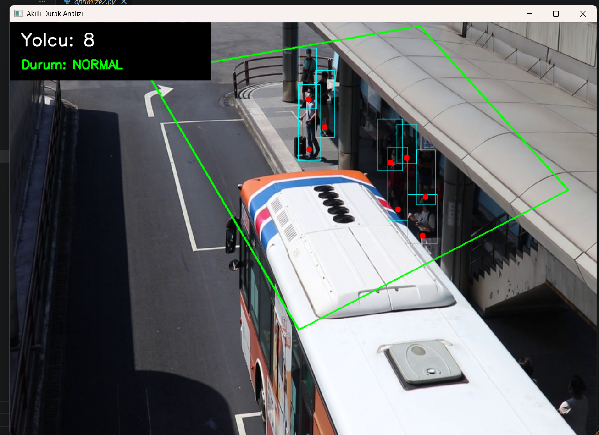
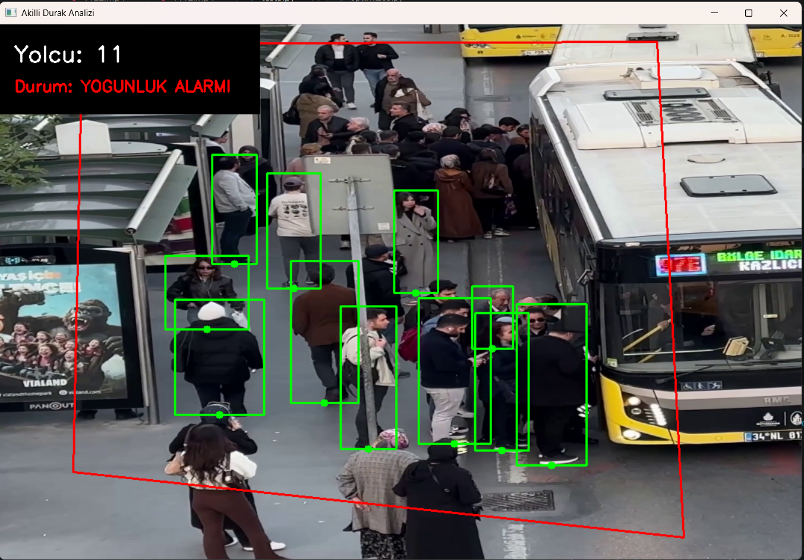
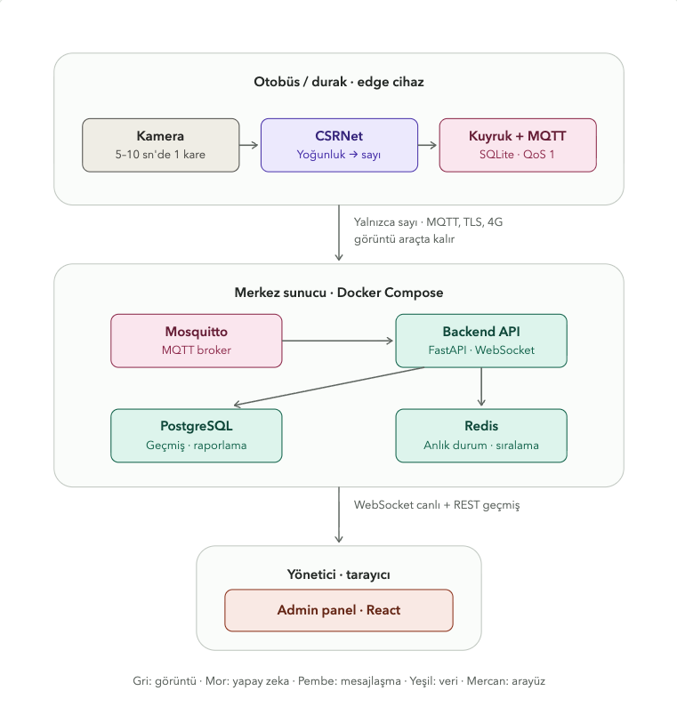

  </details>

---

  <details>
    <summary><h2>Sprint Board Update</h2></summary>


  </details>

---

  <details>
    <summary><h2>Daily Scrum</h2></summary>

.png)


  </details>

---

  <details>
    <summary><h2>Sprint Notes</h2></summary>

- It was decided to use _Trello_ for project management.
- Daily scrum meetings were held via _WhatsApp_ and _Google Meet_ according to team availability.
- It was decided to use _Python_ for the image processing model, and _CSRNet_ was selected as the density estimation model.
- It was decided to use _Firebase_ for the backend.
- It was decided to focus on research and planning in the first sprint.

- **Expected point completion within Sprint:** 200 points

- **Point Completion Logic:** A total target of 1000 points was set. In Sprint 1, 200 points were targeted and completed as the focus was on research and planning. In Sprint 2, 400 points are targeted as the development phase begins. In Sprint 3, 400 points are targeted for the remaining development and integration work.

- **Product Backlog URL:** [Click for Backlog](https://trello.com/b/2BtcZtM4/yzta-bootcamp)

- **Story Selection:**


<details>
  <summary><h4>Türkçe Açıklama</h4></summary>

- Proje yönetimi için _Trello_ kullanılmasına karar verildi.
- Daily scrum toplantıları, takım müsaitlik durumuna göre _WhatsApp_ ve _Google Meet_ üzerinden gerçekleştirildi.
- Görüntü işleme modeli için _Python_ kullanılmasına karar verildi ve yoğunluk tahmin modeli olarak _CSRNet_ seçildi.
- Backend için _Firebase_ kullanılmasına karar verildi.
- İlk sprintte araştırma ve planlamaya odaklanılmasına karar verildi.

- **Sprint İçinde Tamamlanması Beklenen Puan:** 200 puan

- **Puan Tamamlama Mantığı:** Toplam hedef 1000 puan olarak belirlenmiştir. Sprint 1'de araştırma ve planlama odaklı çalışıldığı için 200 puan hedeflenmiş ve tamamlanmıştır. Sprint 2'de geliştirme aşamasına geçileceğinden 400 puan, Sprint 3'te kalan geliştirme ve entegrasyon çalışmaları için 400 puan hedeflenmiştir.

- **Product Backlog URL:** [Backlog için tıklayın](https://trello.com/b/2BtcZtM4/yzta-bootcamp)

- **Story Seçimi:**


</details>

  </details>

---

  <details>
    <summary><h2>Sprint Review</h2></summary>

- Research on which data sources and models to use was conducted and discussed as a team.
- CSRNet was selected as the density estimation model after evaluation.
- Technology stack decisions were made collectively (Python, Firebase, Trello).
- The possibility of presenting insights via multi-agent systems was discussed and agreed upon as a future direction.
- Features and enhancements expected to be added in upcoming sprints were identified and planned.

- **Sprint Review Participants:** Bilal Solmaz, Kübra Güler, Saadettin Berber, Özlem Çal, Pınar Akdoğan

<details>
  <summary><h4>Türkçe Açıklama</h4></summary>

- Hangi veri kaynaklarının ve modellerin kullanılacağına dair araştırma yapıldı ve ekip içinde tartışıldı.
- Yoğunluk tahmini modeli olarak CSRNet değerlendirmeler sonucunda seçildi.
- Teknoloji yığını kararları ekip olarak ortaklaşa alındı (Python, Firebase, Trello).
- Multi-agent sistemler aracılığıyla içgörüler sunulabileceği tartışıldı ve gelecek bir hedef olarak benimsendi.
- İlerleyen sprintlerde eklenmesi beklenen özellikler ve geliştirmeler belirlendi ve planlandı.

- **Sprint Review Katılımcıları:** Bilal Solmaz, Kübra Güler, Saadettin Berber, Özlem Çal, Pınar Akdoğan

</details>

  </details>

---

  <details>
    <summary><h2>Sprint Retrospective</h2></summary>

- Task distribution within the team and individual assignments will be clarified at the beginning of the second sprint.
- In the second sprint, the development phase will begin; admin panel UI setup and image processing model implementation will be initiated.
- Firebase integration (backend deploy) will be set up in the second sprint.
- Work on Authentication for the admin panel will begin.
- Data logging API development will be started.
- Live density map UI and Heatmap UI implementation will be planned.
- Frontend and backend deploy preparations will be made.
- Model Training and Model Evaluation (acc, mAP, loss) processes will be initiated.
- Research on KPIs that can be added via AI Agent will continue.

<details>
  <summary><h4>Türkçe Açıklama</h4></summary>

- Takım içindeki görev dağılımı ve her üyenin görev ataması ikinci sprint başlangıcıyla birlikte netleştirilecektir.
- İkinci sprintte geliştirme aşamasına geçilecek; admin panel arayüzü kurulumu ve görüntü işleme modeli implementasyonuna başlanacaktır.
- Firebase entegrasyonu (backend deploy) ikinci sprintte kurulacaktır.
- Admin panel için Authentication çalışmalarına başlanacaktır.
- Data logging API geliştirmesi başlatılacaktır.
- Live density map UI ve Heatmap UI implementasyonu planlanacaktır.
- Frontend ve backend deploy hazırlıkları yapılacaktır.
- Model Training ve Model Evaluation (acc, mAP, loss) süreçleri başlatılacaktır.
- AI Agent ile eklenebilecek KPI'ların araştırılmasına devam edilecektir.

</details>

  </details>

</details>

---


<details>
  <summary><h1>Sprint 2</h1></summary>

---

  <details>
    <summary><h2>Product Screenshot</h2></summary>

- The backend (FastAPI + PostgreSQL + Redis + MQTT) was deployed with a full hexagonal architecture: ingest, real-time state, REST API, and WebSocket broadcast were all implemented and tested end-to-end.
- The admin panel (React) was built with a login page, dashboard, live map, lines, and stops pages, connected to the backend via REST and WebSocket.
- An AI recommendation engine was added: a weekly-pattern detector (30-day window) produces operational suggestions, and a live-alert detector (3-hour window) flags currently congested lines — both interpreted by an LLM (Gemini or a local Ollama model).
- A local chatbot assistant (OpenJarvis + Ollama) was integrated into the panel, answering density questions by calling the backend API directly — no data leaves the machine by default.
- The CSRNet crowd-density model was run locally/on Kaggle against real bus/road footage, producing a density heatmap and a people-count estimate per frame.
- The trained model was evaluated against ground-truth counts on labeled crowd images to measure estimation error.
- A dedicated test dataset was built from bus interior video frames, manually labeled with the person count per frame, to validate the density pipeline end-to-end.

<details>
  <summary><h4>Türkçe Açıklama</h4></summary>

- Backend (FastAPI + PostgreSQL + Redis + MQTT) tam heksagonal mimariyle deploy edildi: veri alımı, anlık durum, REST API ve WebSocket yayını uçtan uca geliştirilip test edildi.
- Admin panel (React) giriş, gösterge paneli, canlı harita, hatlar ve duraklar sayfalarıyla kuruldu; REST ve WebSocket üzerinden backend'e bağlandı.
- Bir AI öneri motoru eklendi: haftalık örüntü tespiti (30 günlük pencere) operasyonel öneriler üretiyor, anlık uyarı tespiti (3 saatlik pencere) o an yoğun olan hatları işaretliyor — ikisi de bir LLM (Gemini veya lokal Ollama modeli) tarafından yorumlanıyor.
- Panele lokal bir chatbot asistanı (OpenJarvis + Ollama) entegre edildi; yoğunluk sorularını doğrudan backend API'sini çağırarak yanıtlıyor — varsayılan kurulumda hiçbir veri makineden çıkmıyor.
- CSRNet kalabalık yoğunluğu modeli lokal/Kaggle üzerinde gerçek otobüs/yol görüntülerine karşı çalıştırılarak yoğunluk ısı haritası ve kare başına kişi sayısı tahmini üretildi.
- Eğitilmiş model, etiketlenmiş kalabalık görüntüleri üzerinde gerçek (ground-truth) sayımlarla karşılaştırılarak tahmin hatası ölçüldü.
- Yoğunluk hattını uçtan uca doğrulamak için otobüs içi video karelerinden, kare başına kişi sayısı manuel olarak etiketlenmiş özel bir test veri seti oluşturuldu.

</details>

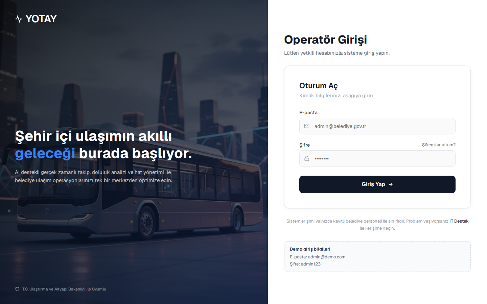
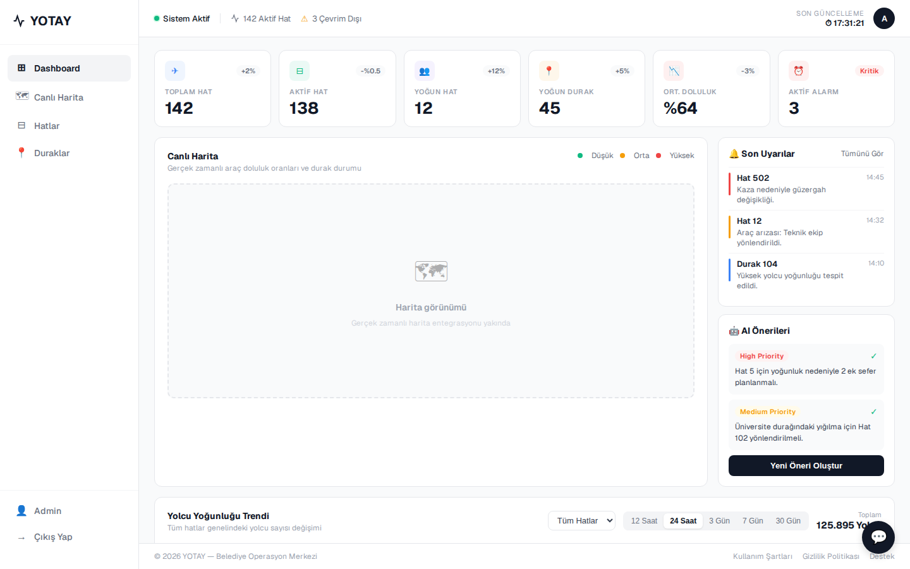
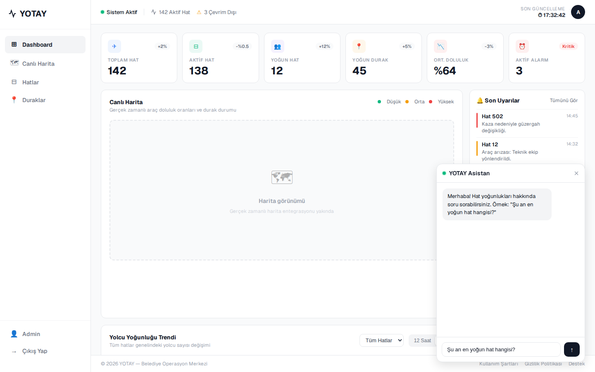
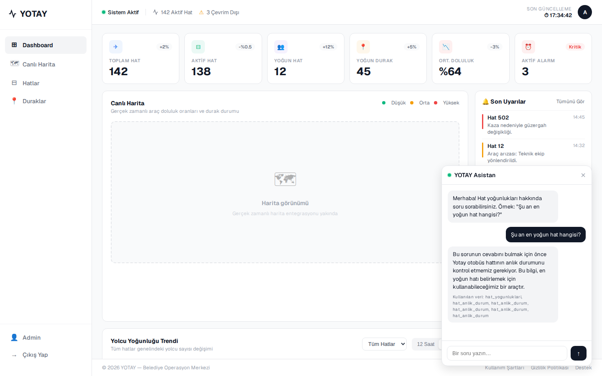


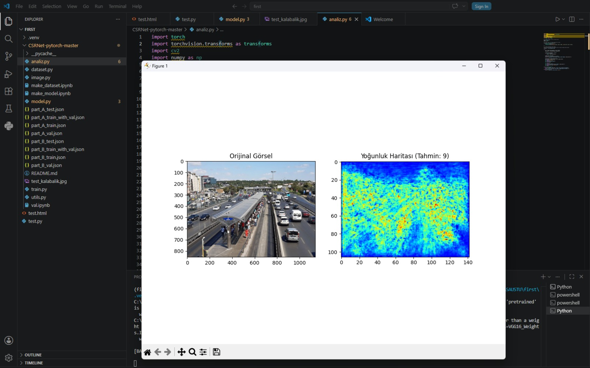
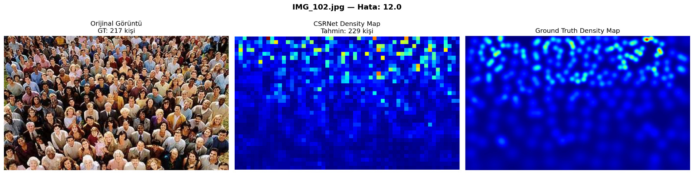
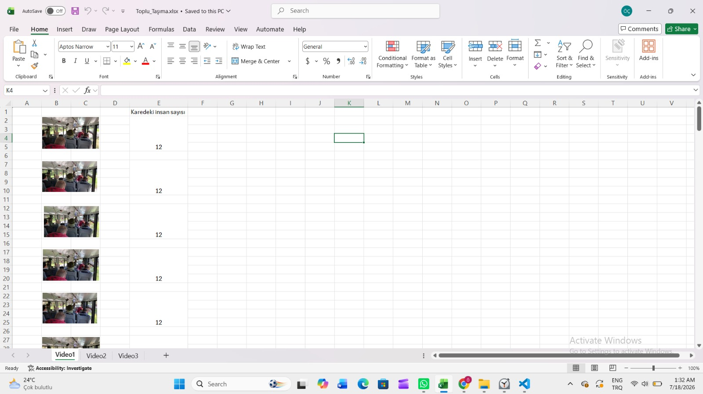

  </details>

---

  <details>
    <summary><h2>AI Motoru Kanıtları (Local, Ollama)</h2></summary>

Backend'in `AI_MOTOR=local` modunda, hiçbir veri makineden çıkmadan Ollama üzerinde çalışan `turkish-gemma-9b-v0.1` modeliyle ürettiği gerçek öneri/uyarı çıktıları:

```text
===================================================================
 YOTAY — YEREL AI MOTORU (OpenJarvis SimpleAgent + Ollama)
 Kanit loglari — 18.07.2026 17:35
===================================================================

### 1) Motor yapilandirmasi (veri makineden cikmiyor)
    local
    http://localhost:11434
    alibayram/turkish-gemma-9b-v0.1:latest

### 2) Servis sagligi
    {
        "durum": "ok",
        "bagimliliklar": {
            "postgres": "ok",
            "redis": "ok",
            "mqtt": "ok"
        }
    }

### 3) Yerel model ile URETILEN ONERILER (Ollama, internet yok)
    [
        {
            "id": 3,
            "hat_id": 1,
            "gun_no": 1,
            "saat_baslangic": 8,
            "saat_bitis": 9,
            "ortalama_doluluk": 0.8829861111111109,
            "karsilastirma_ortalama_doluluk": 0.4018634259259261,
            "oneri_metni": "Pazartesi sabah 8'de sefer sayısını artırmayı düşünün",
            "gerekce": "Ortalama doluluk oranı (0.88) diğer günlere göre belirgin şekilde yüksek.",
            "olusturulma_zamani": "2026-07-18T14:29:03.821817Z"
        },
        {
            "id": 4,
            "hat_id": 1,
            "gun_no": 1,
            "saat_baslangic": 9,
            "saat_bitis": 10,
            "ortalama_doluluk": 0.8673611111111111,
            "karsilastirma_ortalama_doluluk": 0.40239583333333345,
            "oneri_metni": "Pazartesi sabah 9'da sefer sayısını artırmayı düşünün",
            "gerekce": "Ortalama doluluk oranı (0.87) diğer günlere göre belirgin şekilde yüksek.",
            "olusturulma_zamani": "2026-07-18T14:29:03.821817Z"
        },
        {
            "id": 1,
            "hat_id": 1,
            "gun_no": 1,
            "saat_baslangic": 8,
            "saat_bitis": 8,
            "ortalama_doluluk": 0.8829861111111109,
            "karsilastirma_ortalama_doluluk": 0.4018634259259261,
            "oneri_metni": "Pazartesi sabahı 08:00 seferlerinde doluluk oranının yüksek olduğu gözlemlenmiştir. Trafik yoğunluğunu azaltmak için ek araç veya daha sık sefer periyotunu değerlendirin.",
            "gerekce": "Doluluk oranı (0.88) diğer günlere kıyasla belirgin şekilde yüksektir.",
            "olusturulma_zamani": "2026-07-18T13:37:06.532671Z"
        },
        {
            "id": 2,
            "hat_id": 1,
            "gun_no": 1,
            "saat_baslangic": 9,
            "saat_bitis": 9,
            "ortalama_doluluk": 0.8673611111111111,
            "karsilastirma_ortalama_doluluk": 0.40239583333333345,
            "oneri_metni": "Pazartesi sabahı 09:00 seferlerinde doluluk oranının yüksek olduğu gözlemlenmiştir. Trafik yoğunluğunu azaltmak için ek araç veya daha sık sefer periyotunu değerlendirin.",
            "gerekce": "Doluluk oranı (0.87) diğer günlere kıyasla belirgin şekilde yüksektir.",
            "olusturulma_zamani": "2026-07-18T13:37:06.532671Z"
        }
    ]

### 4) Yerel model ile URETILEN UYARILAR
    [
        {
            "id": 1,
            "hat_id": 3,
            "ortalama_doluluk": 1.5271604938271603,
            "ortalama_kisi": 45.81481481481482,
            "uyari_metni": "Yoğunluk eşiği aşılmıştır. Ek sefer değerlendirilebilir.",
            "gerekce": "Ortalama doluluk oranı %152.7 olarak ölçülmüştür.",
            "olusturulma_zamani": "2026-07-18T14:30:36.843826Z"
        }
    ]
```

  </details>

---

  <details>
    <summary><h2>Sprint Board Update</h2></summary>

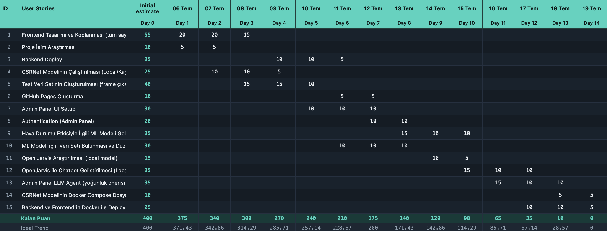

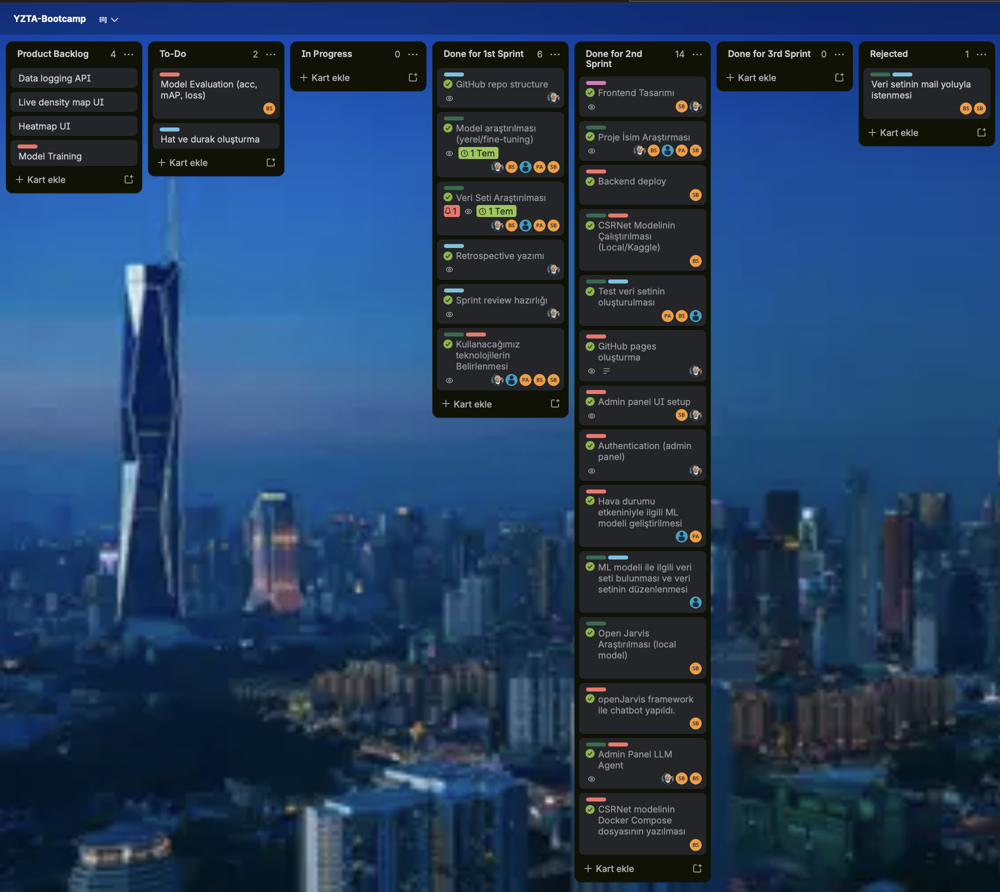

  </details>

---

  <details>
    <summary><h2>Daily Scrum</h2></summary>

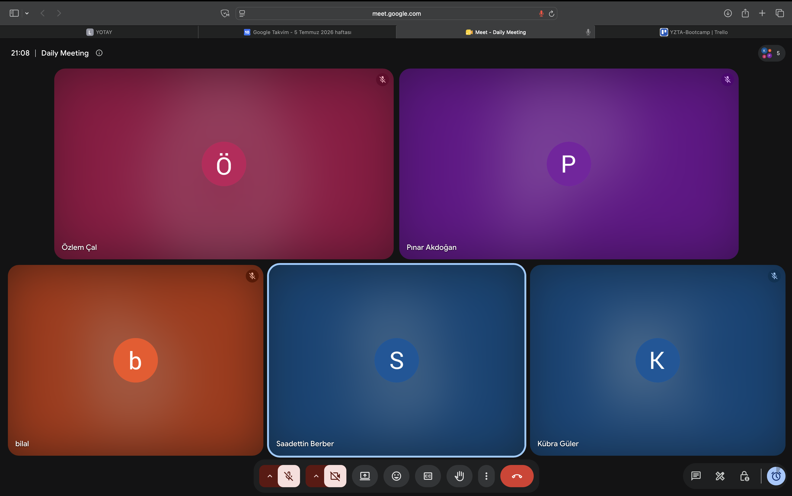
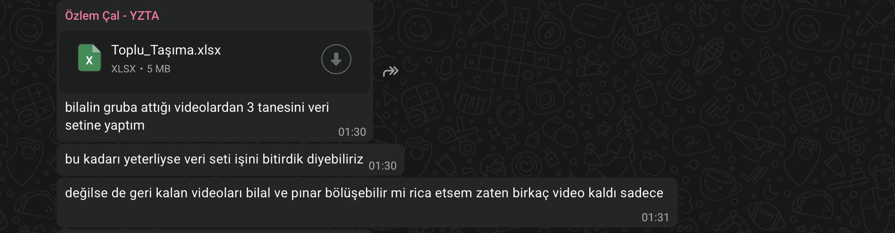
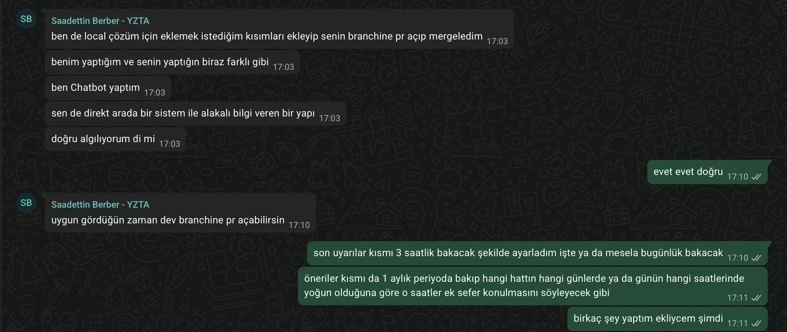
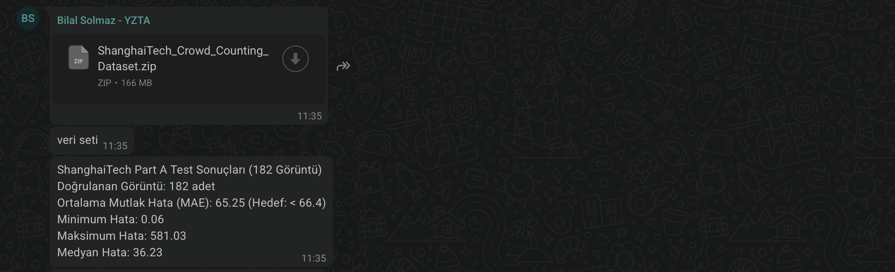
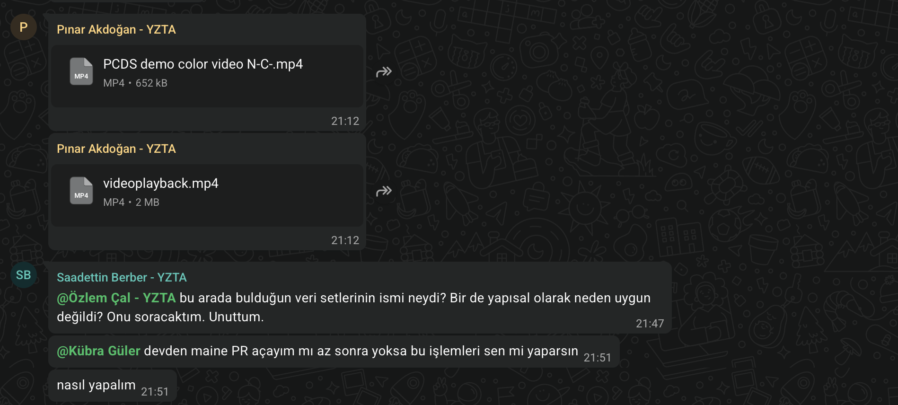

  </details>

---

  <details>
    <summary><h2>Sprint Notes</h2></summary>

- It was decided to develop the backend with a hexagonal (ports & adapters) architecture on FastAPI, PostgreSQL, Redis, and MQTT, and to deploy it before connecting the frontend.
- It was decided to build the admin panel with React first (login, dashboard, live map, lines, stops) and connect it to the backend incrementally, screen by screen, via REST and WebSocket.
- It was decided to make CORS configurable and add JWT-based authentication so the panel could safely and securely call the backend across origins.
- It was decided to run the CSRNet crowd-density model locally and on Kaggle against real footage, then formally evaluate it (accuracy, mAP, loss / MAE) against labeled data before trusting its output.
- It was decided to build a dedicated test dataset from real bus-interior video frames, with the person count per frame labeled manually, instead of relying only on generic public datasets.
- It was decided to research a fully local LLM option (OpenJarvis on Ollama) so AI features would not require sending data to an external cloud provider by default.
- It was decided to add an AI recommendation/alert engine directly inside the backend (weekly-pattern suggestions + 3-hour anomaly alerts), interpreted by an LLM behind a provider-agnostic port.
- It was decided to build a separate interactive chatbot assistant on top of the same local-first principle, reading live data from the backend via tool calls, with an optional cloud (Gemini) fallback documented clearly for lower-quality-answer cases.
- It was decided to containerize the whole stack (panel + backend + assistant + local LLM + database + broker) behind a single root-level `docker-compose.yml`, so the entire system can be started with one command.
- It was decided to keep the GitHub Pages documentation (architecture, API/MQTT contracts, AI engine, assistant) up to date as each piece of the system was built.

- **Expected point completion within Sprint:** 400 points

- **Point Completion Logic:** A total target of 1000 points was set. In Sprint 1, 200 points were targeted and completed as the focus was on research and planning. In Sprint 2, 400 points were targeted as the development phase began; all 15 backlog stories tracked on the burndown chart were completed within the 14-day window, bringing the remaining points to 0 by Day 14. In Sprint 3, 400 points are targeted for the remaining development and integration work.

- **Product Backlog URL:** [Click for Backlog](https://trello.com/b/2BtcZtM4/yzta-bootcamp)

- **Story Selection:**


<details>
  <summary><h4>Türkçe Açıklama</h4></summary>

- Backend'in FastAPI, PostgreSQL, Redis ve MQTT üzerinde heksagonal (port & adaptör) mimariyle geliştirilmesine ve frontend bağlanmadan önce deploy edilmesine karar verildi.
- Admin panelin önce React ile kurulmasına (giriş, gösterge paneli, canlı harita, hatlar, duraklar) ve REST/WebSocket üzerinden ekran ekran, aşamalı olarak gerçek backend'e bağlanmasına karar verildi.
- Panel farklı origin'lerden backend'i güvenle çağırabilsin diye CORS'un yapılandırılabilir hale getirilmesine ve JWT tabanlı kimlik doğrulama eklenmesine karar verildi.
- CSRNet kalabalık yoğunluğu modelinin lokal ve Kaggle üzerinde gerçek görüntülere karşı çalıştırılmasına, ardından çıktısına güvenmeden önce etiketlenmiş veriyle biçimsel olarak değerlendirilmesine (doğruluk, mAP, loss / MAE) karar verildi.
- Yalnızca genel amaçlı halka açık veri setlerine güvenmek yerine, otobüs içi gerçek video karelerinden, kare başına kişi sayısı manuel etiketlenmiş özel bir test veri seti oluşturulmasına karar verildi.
- AI özelliklerinin varsayılan olarak veriyi dış bir bulut sağlayıcısına göndermek zorunda kalmaması için tamamen lokal bir LLM seçeneğinin (OpenJarvis + Ollama) araştırılmasına karar verildi.
- Backend içine doğrudan bir AI öneri/uyarı motoru (haftalık örüntü önerileri + 3 saatlik anomali uyarıları) eklenmesine, bunun sağlayıcıdan bağımsız bir port arkasında bir LLM tarafından yorumlanmasına karar verildi.
- Aynı "önce lokal" ilkesinin üzerine, backend'den tool çağrılarıyla canlı veri okuyan ayrı, etkileşimli bir chatbot asistanı geliştirilmesine; cevap kalitesinin düştüğü durumlar için açıkça belgelenmiş opsiyonel bir bulut (Gemini) yedeğinin eklenmesine karar verildi.
- Tüm sistemin (panel + backend + asistan + lokal LLM + veritabanı + broker) tek bir kök `docker-compose.yml` arkasında konteynerlenmesine, böylece tüm sistemin tek komutla başlatılabilmesine karar verildi.
- Sistemin her parçası geliştirildikçe GitHub Pages dokümantasyonunun (mimari, API/MQTT sözleşmeleri, AI motoru, asistan) güncel tutulmasına karar verildi.

- **Sprint İçinde Tamamlanması Beklenen Puan:** 400 puan

- **Puan Tamamlama Mantığı:** Toplam hedef 1000 puan olarak belirlenmiştir. Sprint 1'de araştırma ve planlama odaklı çalışıldığı için 200 puan hedeflenmiş ve tamamlanmıştır. Sprint 2'de geliştirme aşamasına 400 puan hedefiyle geçilmiş; burndown chart'ta takip edilen 15 backlog story'nin tamamı 14 günlük pencerede tamamlanarak kalan puan 14. günde 0'a indirilmiştir. Sprint 3'te kalan geliştirme ve entegrasyon çalışmaları için 400 puan hedeflenmiştir.

- **Product Backlog URL:** [Backlog için tıklayın](https://trello.com/b/2BtcZtM4/yzta-bootcamp)

- **Story Seçimi:**


</details>

### Sistemi Çalıştırma / Running the System

**1) Tek komutla tüm sistem (önerilen) — Docker Compose**

```bash
# Kök dizinden: panel + backend + asistan + lokal LLM (Ollama) + PostgreSQL + Redis + MQTT
docker compose up --build

# Tohum veriyle birlikte canlı sahte veri akışı (simülatör) da istenirse:
docker compose --profile demo up --build
```

- Panel: `http://localhost:3000` (sağ altta asistan sohbeti)
- Backend API: `http://localhost:8000` (`/docs` altında Swagger arayüzü)
- Asistan servisi: `http://localhost:8100`
- İlk açılışta hem asistan hem backend'in lokal AI motoru, kullandıkları Ollama modellerini (`qwen3.5:0.8b` ~1 GB, öneri/uyarı motoru için ayrıca `YEREL_MODEL`) indirir; modeller kalıcı bir volume'da kalır, sonraki açılışlar beklemesizdir.
- Backend'deki AI Önerileri (30 günlük örüntü) ve Son Uyarılar (3 saatlik anlık) motorları varsayılan olarak `AI_MOTOR=local` ile tamamen lokal çalışır; container her açıldığında zamanlamayı beklemeden bir kez otomatik tetiklenir.
- Opsiyonel bulut motoruna (Gemini) geçmek için kök dizine bir `.env` dosyası eklenip `GEMINI_API_KEY` tanımlanabilir; asistan için `ASISTAN_MOTOR=cloud`, backend AI motoru için `AI_MOTOR=gemini` ayarlanır — bkz. `asistan/README.md` ve `backend/README.md`. `.env` `.gitignore`'da olduğu için anahtar hiçbir zaman repoya girmez.

**2) Sadece backend — Docker**

```bash
cd backend
docker compose up --build -d
python -m app.seed   # tek seferlik: örnek hat/araç/cihaz verisi
```

- Backend: `http://localhost:8000`
- Testler: `uv run pytest tests/unit` (birim), `uv run pytest tests/entegrasyon` (entegrasyon, çalışan bir stack gerektirir)

**3) Sadece frontend — geliştirme (Vite dev server)**

```bash
cd frontend
npm install
npm run dev
```

- Panel: `http://localhost:5173` (backend'in `http://localhost:8000`'de ayakta olması beklenir)
- Üretim build'i: `npm run build` (çıktı `dist/`), ya da `docker compose up --build` ile Nginx üzerinden konteynerli servis

**Gereksinimler:** Docker Desktop (Compose dahil), Node.js 18+ (yalnızca frontend'i Docker dışında çalıştırmak için), Python 3.12 + `uv` (yalnızca backend'i Docker dışında çalıştırmak için). Lokal AI motorları için Ollama'nın indireceği modeller birkaç GB yer kaplayabilir; Docker Desktop'a ayrılan bellek limitinin en az 8 GB olması önerilir.

  </details>

---

  <details>
    <summary><h2>Sprint Review</h2></summary>

- The backend was deployed end-to-end with a fully test-covered hexagonal architecture: MQTT ingest, Redis live state, REST API, and WebSocket broadcast were all implemented, wired together in a composition root, and validated with unit and integration tests.
- JWT-based authentication was added to the backend and wired into the panel's login flow, so only authorized operators can reach the dashboard.
- Configurable CORS middleware was added so the panel (served from a different origin/port) could safely call the backend without hardcoded exceptions.
- The admin panel frontend was built out with React across five core screens — login, dashboard (with an interactive passenger density chart), live map, lines, and stops — and connected to the real backend via REST and WebSocket instead of static mock data.
- An AI recommendation/alert engine was designed and implemented directly inside the backend using the existing hexagonal ports/adapters: a 30-day weekly-pattern SQL query feeds the "AI Suggestions" flow, and a 3-hour anomaly query feeds the "Recent Alerts" flow, both interpreted by an LLM behind the same port.
- The AI engine was made provider-agnostic: it initially supported Gemini, then a fully local Ollama-based generator (OpenJarvis SimpleAgent) was added behind the same port so the system can run with zero data leaving the machine; the active engine is now selected via a single `AI_MOTOR` setting.
- A separate local chatbot assistant (OpenJarvis on Ollama) was researched and built as its own service, answering operator questions by calling the backend's REST endpoints as tools; an optional cloud (Gemini) engine was added afterwards for cases where the local model's answer quality is insufficient, with a clear privacy warning documented for that mode.
- The CSRNet crowd-density model was run locally and on Kaggle against real bus/road footage, producing density heatmaps and per-frame people-count estimates.
- The trained CSRNet model was evaluated against ground-truth counts on labeled crowd images (including the ShanghaiTech dataset) to measure estimation error (MAE, min/max/median error).
- A dedicated test dataset was built from real bus-interior video frames, manually labeled with the person count per frame, to validate the density pipeline end-to-end under realistic conditions.
- The frontend was containerized with a production Nginx service, and a root-level `docker-compose.yml` was added so the entire stack (panel + backend + assistant + local LLM + database + broker) can be started with a single command.
- GitHub Pages documentation was significantly expanded to keep the project log in sync with the fast pace of development: architecture, API/MQTT contracts, the AI engine, and the assistant service were all documented.
- Two independently developed AI workstreams (the backend recommendation/alert engine and the separate chatbot assistant) were reconciled and merged into a single, consistent codebase without losing either team member's work.

- **Sprint Review Participants:** Bilal Solmaz, Kübra Güler, Saadettin Berber, Özlem Çal, Pınar Akdoğan

<details>
  <summary><h4>Türkçe Açıklama</h4></summary>

- Backend, tam test kapsamına sahip heksagonal mimariyle uçtan uca deploy edildi: MQTT veri alımı, Redis anlık durum, REST API ve WebSocket yayını geliştirilip bir kompozisyon kökünde birbirine bağlandı, birim ve entegrasyon testleriyle doğrulandı.
- Backend'e JWT tabanlı kimlik doğrulama eklendi ve panelin giriş akışına kablolandı; böylece gösterge paneline yalnızca yetkili operatörler erişebiliyor.
- Panel (farklı origin/port'tan sunulduğu için) backend'i güvenle çağırabilsin diye yapılandırılabilir CORS middleware eklendi, sabit kodlu istisnalara gerek kalmadı.
- Admin panel frontend'i React ile beş temel ekranda (giriş, etkileşimli yolcu yoğunluğu grafiğine sahip gösterge paneli, canlı harita, hatlar, duraklar) hayata geçirildi ve statik mock veri yerine REST ve WebSocket üzerinden gerçek backend'e bağlandı.
- Backend içinde, mevcut heksagonal port/adaptör yapısı kullanılarak doğrudan bir AI öneri/uyarı motoru tasarlanıp geliştirildi: 30 günlük haftalık örüntü SQL sorgusu "AI Önerileri" akışını, 3 saatlik anomali sorgusu "Son Uyarılar" akışını besliyor; ikisi de aynı port arkasında bir LLM tarafından yorumlanıyor.
- AI motoru sağlayıcıdan bağımsız hale getirildi: önce Gemini desteklendi, ardından aynı port arkasında tamamen lokal bir Ollama tabanlı üretici (OpenJarvis SimpleAgent) eklenerek sistemin hiçbir veri makineden çıkmadan çalışabilmesi sağlandı; aktif motor artık tek bir `AI_MOTOR` ayarıyla seçiliyor.
- Ollama üzerinde OpenJarvis tabanlı ayrı bir lokal chatbot asistanı araştırılıp kendi servisi olarak inşa edildi; operatör sorularını backend'in REST uçlarını tool olarak çağırarak yanıtlıyor. Lokal modelin cevap kalitesi yetmediği durumlar için sonradan opsiyonel bir bulut (Gemini) motoru eklendi, bu moda dair açık bir gizlilik uyarısı belgelendi.
- CSRNet kalabalık yoğunluğu modeli lokal ve Kaggle üzerinde gerçek otobüs/yol görüntülerine karşı çalıştırılarak yoğunluk ısı haritaları ve kare başına kişi sayısı tahminleri üretildi.
- Eğitilmiş CSRNet modeli, etiketlenmiş kalabalık görüntüleri (ShanghaiTech veri seti dahil) üzerinde gerçek (ground-truth) sayımlarla karşılaştırılarak tahmin hatası (MAE, min/maks/medyan hata) ölçüldü.
- Yoğunluk hattını gerçekçi koşullar altında uçtan uca doğrulamak için otobüs içi gerçek video karelerinden, kare başına kişi sayısı manuel olarak etiketlenmiş özel bir test veri seti oluşturuldu.
- Frontend, üretim Nginx servisiyle konteynerlenip kök dizine bir `docker-compose.yml` eklendi; böylece tüm sistem (panel + backend + asistan + lokal LLM + veritabanı + broker) tek komutla ayağa kalkabiliyor.
- Proje günlüğünü geliştirmenin hızına ayak uydurarak güncel tutmak için GitHub Pages dokümantasyonu önemli ölçüde genişletildi: mimari, API/MQTT sözleşmeleri, AI motoru ve asistan servisi belgelendi.
- Birbirinden bağımsız geliştirilen iki AI çalışması (backend'deki öneri/uyarı motoru ve ayrı chatbot asistanı) hiçbir takım üyesinin emeği kaybolmadan tek, tutarlı bir kod tabanında birleştirildi.

- **Sprint Review Katılımcıları:** Bilal Solmaz, Kübra Güler, Saadettin Berber, Özlem Çal, Pınar Akdoğan

</details>

  </details>

---

  <details>
    <summary><h2>Sprint Retrospective</h2></summary>

**What went well**

- The hexagonal architecture on the backend paid off directly: swapping and adding LLM providers (Gemini → local Ollama) for the AI recommendation/alert engine required changes only inside the adapter layer, with zero changes to the domain or application logic.
- The single-command, full-stack Docker Compose setup proved its value — it allowed the whole team to run and demo the panel, backend, database, and both AI paths locally without individual environment setup.
- Building a dedicated, manually labeled test dataset from real bus footage gave the team a much more trustworthy CSRNet evaluation than relying on generic public datasets alone.

**What needs improvement**

- The AI recommendation/alert engine and the chatbot assistant were built in parallel by different team members without early alignment on architecture; a merge was needed afterwards to reconcile both into a single source of truth. Earlier coordination on shared modules (LLM provider abstraction, Docker Compose) is planned for Sprint 3.
- Downloading larger local LLM models over an unstable connection caused repeated interruptions and multiple restarts; a fallback to a smaller model, resumable downloads, or a documented retry strategy will be considered going forward.
- The dashboard's "AI Suggestions" and "Recent Alerts" cards were connected to the real backend endpoints only late in the sprint; earlier end-to-end wiring between frontend and backend features is a goal for Sprint 3.

**Planned for Sprint 3**

- A live mapping system will be built to visualize vehicles and stops geographically on the dashboard, replacing the current placeholder map.
- Lines and stops will be added to the database as first-class, manageable records (instead of only seed data), so the admin panel can reflect the real route network.
- The CSRNet model and its evaluated weights will be integrated into the live pipeline, so density detection on vehicles runs as part of the actual data flow — not just as an offline research script.
- The entire system will be moved from mock/demo data to fully live data end-to-end: real camera/edge input through MQTT, through the backend, into the dashboard, recommendations, and alerts.
- Frontend-backend Docker deployment will be finalized and documented as a single, reproducible production flow.
- Automated tests will be added for the frontend (currently backend-only) to keep the growing UI surface safe to change.

<details>
  <summary><h4>Türkçe Açıklama</h4></summary>

**İyi giden yönler**

- Backend'deki heksagonal mimari doğrudan karşılığını verdi: AI öneri/uyarı motorunda LLM sağlayıcısını değiştirmek/eklemek (Gemini → lokal Ollama) yalnızca adaptör katmanında değişiklik gerektirdi, domain veya application mantığına hiç dokunulmadı.
- Tek komutla ayağa kalkan tam-stack Docker Compose kurulumu değerini kanıtladı — tüm ekibin panel, backend, veritabanı ve her iki AI yolunu da bireysel ortam kurulumu yapmadan lokal olarak çalıştırıp demo edebilmesini sağladı.
- Gerçek otobüs görüntülerinden manuel etiketlenmiş özel bir test veri seti oluşturmak, yalnızca genel amaçlı halka açık veri setlerine güvenmek yerine ekibe çok daha güvenilir bir CSRNet değerlendirmesi kazandırdı.

**Geliştirilmesi gereken yönler**

- AI öneri/uyarı motoru ile chatbot asistanı, farklı takım üyeleri tarafından mimari üzerinde erken hizalanmadan paralel geliştirildi; sonrasında ikisini tek bir doğru kaynakta birleştirmek için bir merge gerekti. Paylaşılan modüller (LLM sağlayıcı soyutlaması, Docker Compose) üzerinde daha erken koordinasyon Sprint 3 için planlanıyor.
- Kararsız bir bağlantı üzerinden büyük lokal LLM modelleri indirmek tekrar tekrar kesintiye uğradı ve birçok kez yeniden başlatılması gerekti; ileride daha küçük bir modele düşme, devam ettirilebilir indirme ya da belgelenmiş bir yeniden deneme stratejisi değerlendirilecek.
- Gösterge panelindeki "AI Önerileri" ve "Son Uyarılar" kartları gerçek backend uçlarına ancak sprintin geç bir aşamasında bağlandı; frontend ile backend özellikleri arasında daha erken uçtan uca kablolama Sprint 3 için bir hedef.

**Sprint 3 için planlananlar**

- Gösterge panelindeki mevcut yer tutucu haritanın yerine, araçları ve durakları coğrafi olarak görselleştiren canlı bir haritalandırma sistemi kurulacak.
- Hatlar ve duraklar, sadece tohum verisi olarak değil, admin panelin gerçek güzergah ağını yansıtabilmesi için veritabanına yönetilebilir birinci sınıf kayıtlar olarak eklenecek.
- CSRNet modeli ve değerlendirilmiş ağırlıkları canlı akışa entegre edilerek, araçlardaki yoğunluk tespiti çevrimdışı bir araştırma script'i olarak değil, gerçek veri akışının bir parçası olarak çalışacak.
- Tüm sistem, mock/demo veriden uçtan uca tamamen canlı veriye taşınacak: gerçek kamera/uç cihaz girdisinden MQTT üzerinden backend'e, oradan gösterge paneline, önerilere ve uyarılara kadar.
- Frontend-backend Docker deploy'u, tek ve tekrarlanabilir bir üretim akışı olarak sonlandırılıp belgelenecek.
- Büyüyen arayüz yüzeyini güvenle değiştirebilmek için frontend'e de (şu an yalnızca backend'de olan) otomatik testler eklenecek.

</details>

  </details>

</details>

---


<details>
  <summary><h1>Sprint 3</h1></summary>

---

  <details>
    <summary><h2>Product Screenshot</h2></summary>

  </details>

---

  <details>
    <summary><h2>Sprint Board Update</h2></summary>

  </details>

---

  <details>
    <summary><h2>Daily Scrum</h2></summary>

  </details>

---

  <details>
    <summary><h2>Sprint Notes</h2></summary>

  </details>

---

  <details>
    <summary><h2>Sprint Review</h2></summary>

  </details>

---

  <details>
    <summary><h2>Sprint Retrospective</h2></summary>

  </details>

</details>
