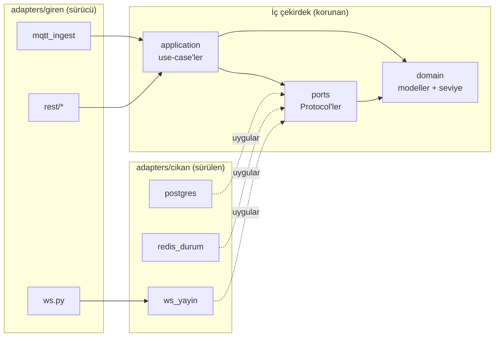

# HAT 01 Backend

Toplu taşıma araçlarındaki edge cihazlardan gelen yoğunluk ölçümlerini alan, işleyen ve panele hem tarihsel (REST) hem canlı (WebSocket) sunan async FastAPI servisi.

Sistemdeki yeri:

```
edge cihazlar ──MQTT──▶ [ HAT 01 Backend ] ──REST + WebSocket──▶ panel (frontend)
```

- **Edge** içeri MQTT ile girer (`filo/{cihaz_id}/yogunluk`, `filo/{cihaz_id}/durum`).
- **Panel** REST ile geçmişi/özeti okur, WebSocket ile canlı güncelleme alır.

---

## Nereden başlamalı?

Rolüne göre git:

- **Frontend geliştiricisiysen:** Önce [Hızlı başlangıç](#hızlı-başlangıç) ile ortamı ayağa kaldır, seed + simulator ile sahte veri akıt, sonra [REST + WebSocket sözleşmesi](#rest--websocket-sözleşmesi) bölümüne bak. Kesin alan referansı için servis ayaktayken `http://localhost:8000/docs` (Swagger). **CORS ayarlı:** varsayılan olarak `http://localhost:3000` ve `http://localhost:5173` origin'lerine izin verilir; farklı bir origin'den çağırıyorsan `CORS_IZINLI_ORIGINLER` ile ver — bkz. [Sık takılınan yerler](#sık-takılınan-yerler).
- **Edge / cihaz geliştiricisiysen:** [MQTT sözleşmesi](#mqtt-sözleşmesi) senin bölümün — topic desenleri, payload alanları (dikkat: yoğunlukta alan adı `timestamp`, gerisi Türkçe), QoS, dedup kuralı. `simulator/simulator.py` referans bir yayıncıdır, ondan kopyalayabilirsin.
- **Backend'e katkı vereceksen:** [Mimari](#mimari) bölümünü oku — katman kuralları var ve `test_mimari.py` onları otomatik zorluyor. Sonra [Proje yapısı](#proje-yapısı) ve [Test & geliştirme](#test--geliştirme).

---

## Mimari

Heksagonal (Ports & Adapters). Amaç: iş kuralları (domain + use-case) altyapıdan (PostgreSQL, Redis, MQTT, WebSocket) tamamen habersiz kalsın; altyapıyı değiştirmek iş kurallarına dokunmasın.

### Katmanlar ve sorumlulukları

Tümü `app/` altında:

| Katman | Dizin | Sorumluluk |
|---|---|---|
| **domain** | `app/domain/` | Saf iş nesneleri (`modeller.py`: frozen+slots dataclass'lar) ve saf kurallar (`seviye.py`: `doluluk_orani_hesapla`, `seviye_belirle`). Hiçbir dış kütüphane import etmez. Eşik sayıları burada yok — kural var, değer dışarıdan parametre gelir. |
| **ports** | `app/ports/` | `Protocol` sözleşmeleri. `depolar.py` (`OlcumDeposuPort`, `AtamaDeposuPort`), `anlik_durum.py` (`AnlikDurumPort`), `canli_yayin.py` (`CanliYayinPort`). Yalnız `app.domain` ve `app.ports` import eder. |
| **application** | `app/application/` | Use-case'ler. `olcum_isle.py` (`OlcumIsleyici` + `SeviyeEsikleri`), `cihaz_durum_isle.py` (`CihazDurumIsleyici`). Yalnız domain + ports'a konuşur, somut altyapıyı bilmez. |
| **adapters/giren** | `app/adapters/giren/` | Sürücü (driving) adaptörler — sistemi dışarıdan **tetikleyen** girdi uçları: `mqtt_ingest.py`, `ws.py`, `rest/*`. |
| **adapters/cikan** | `app/adapters/cikan/` | Sürülen (driven) adaptörler — use-case'in **çağırdığı** çıktı uçları: `postgres/`, `redis_durum.py`, `ws_yayin.py`. Bir port `Protocol`'ünü uygular. |

### Bağımlılık yönü kuralı: oklar yalnız içeri döner



- **domain** hiçbir şeye bağımlı değil (en iç).
- **ports** → domain'e.
- **application** → domain + ports'a.
- **adapters** dıştadır, içeriye bağımlıdır; ama korunan üç katman adapters'ı **asla** import edemez. Somut bağlama yalnız `main.py`'de yapılır.

### Sürücü vs. sürülen adaptör

- **Sürücü (giren):** akışı başlatır. MQTT dinleyicisi mesaj gelince use-case'i çağırır; REST router'ları HTTP isteğiyle; `ws.py` istemci bağlantısını `ws_yayin`'a kaydeder.
- **Sürülen (cikan):** use-case tarafından çağrılır, bir port'u uygular. `PostgresOlcumDeposu` → `OlcumDeposuPort`, `RedisAnlikDurum` → `AnlikDurumPort`, `BaglantiYoneticisi` (`ws_yayin.py`) → `CanliYayinPort`.

### Port ↔ somut adaptör eşleşmesi

| Port (`Protocol`) | Somut adaptör | Nerede |
|---|---|---|
| `OlcumDeposuPort` / `AtamaDeposuPort` | `PostgresOlcumDeposu` / `PostgresAtamaDeposu` | `adapters/cikan/postgres/depolar.py` |
| `AnlikDurumPort` | `RedisAnlikDurum` | `adapters/cikan/redis_durum.py` |
| `CanliYayinPort` | `BaglantiYoneticisi` | `adapters/cikan/ws_yayin.py` |

### Composition root (`app/main.py`)

`uygulama_olustur()` içindeki lifespan, tüm parçaları burada bağlar: motor + oturum fabrikası, Redis istemcisi ve `RedisAnlikDurum`, `BaglantiYoneticisi`, ardından bunları `OlcumIsleyici` / `CihazDurumIsleyici` içine enjekte eder. MQTT `ingest`, arka plan görevi olarak `asyncio.create_task` ile başlar. REST bağımlılıkları `app.state` üzerinden verilir; testler `dependency_overrides` ile sahtelerini takar. ASGI nesnesi `app.main:uygulama` adıyla export edilir.

### Fitness testi bu kuralı otomatik korur

`tests/unit/test_mimari.py`, `app/domain`, `app/ports`, `app/application` dosyalarındaki **tüm** import'ları AST ile tarar (göreli `from ..` dahil, mutlak yola çözerek). `KATMAN_IZINLERI` her katmanın import edebileceği app-içi kökleri tanımlar; standart kütüphane serbest, app-dışı her şey (sqlalchemy, redis, aiomqtt, fastapi, pydantic) yasak. İhlal varsa test `assert` ile kırılır. `adapters/` ve `main.py` kasıtlı taranmaz — altyapıyı import etmeleri normaldir. Yani `application/` içine yanlışlıkla `import redis` yazarsan test kırılır; aynı satırı bir adaptöre koyarsan test görmez.

---

## Hızlı başlangıç

`backend/` dizininden, kopyala-çalıştır:

```bash
# 1) Altyapı + backend ayağa kalksın (mosquitto, postgres, redis, backend)
docker compose up --build
```

Backend, postgres ve redis healthcheck'lerini bekler; şema açılışta otomatik kurulur (create_all, Alembic yok). Ama **veri gelmez** — seed ayrı adımdır, compose otomatik çalıştırmaz:

```bash
# 2) Bağımlılıklar (yerel geliştirme, dev grubu dahil)
uv sync

# 3) Sahte veri: 3 hat, 5 araç, 1 durak, 6 cihaz + atamalar (idempotent)
python -m app.seed

# 4) Sahte edge cihazlar MQTT'ye yayın yapsın (canlı akış için)
python simulator/simulator.py

# 5) Kesin API referansı
open http://localhost:8000/docs
```

`simulator.py` argümanları (varsayılanlar): `--cihaz 3`, `--periyot 5.0` (sn), `--tunel 0.0` (sn), `--broker localhost`, `--port 1883`. Cihaz id'leri `edge_0001..edge_000N` üretir ve seed'deki `edge_0001..edge_0006` ile eşleşir. Seed + simulator birlikte çalışınca panelde canlı doluluk görünür.

### YOTAY Asistan (chatbot)

Bu backend'in verilerini kullanan, tamamen lokal çalışan bir chatbot servisi
`../asistan/` altında ayrı bir servis olarak bulunur (OpenJarvis + Ollama,
bulut LLM yok). Backend'i buradaki adımlarla değil de tüm sistemi (backend +
asistan + Ollama) tek komutla denemek istiyorsan depo kökündeki
`docker-compose.yml`'u kullan:

```bash
# depo kökünden
docker compose --profile demo up --build
```

Ayrıntılar ve küçük modelle güvenilir tool çağırma reçetesi için
[asistan/README.md](../asistan/README.md).

---

## REST + WebSocket sözleşmesi

Base: `0.0.0.0:8000`, tüm yollar `/api` prefix'li. Aşağıdaki özet yönlendirme içindir; **kesin alan/şema referansı** her zaman `http://localhost:8000/docs` (Swagger).

### REST uçları (özet)

| Metot | Yol | Ne döner | Veri kaynağı |
|---|---|---|---|
| GET | `/api/saglik` | `{durum, bagimliliklar:{postgres,redis,mqtt}}` — sağlıklıysa 200, değilse 503 | postgres + redis + mqtt görev canlılığı |
| GET | `/api/hatlar` | `list[HatOzeti]` | Karma: liste PostgreSQL, `ortalama_doluluk`/`arac_sayisi` Redis |
| GET | `/api/hatlar/{hat_id}/anlik` | `list[AracAnlikDurumu]` | Tamamen Redis (TTL'i düşen araç atlanır) |
| GET | `/api/hatlar/{hat_id}/trend` | `list[TrendNoktasi]` | Tamamen PostgreSQL |
| GET | `/api/araclar/{arac_id}/olcumler` | `list[OlcumYaniti]` | Tamamen PostgreSQL |
| GET | `/api/cihazlar` | `list[CihazYaniti]` | Karma: liste PostgreSQL, `cevrimici`/`son_gorulme` Redis |
| POST | `/api/hatlar` | `{id:int}` (201) | PostgreSQL — çakışma 409 |
| POST | `/api/araclar` | `{id:int}` (201) | PostgreSQL — çakışma 409 |
| POST | `/api/duraklar` | `{id:int}` (201) | PostgreSQL — çakışma 409 |
| POST | `/api/cihazlar` | `{id:str}` (201) | PostgreSQL — çakışma 409 |
| POST | `/api/atamalar` | `{id:int}` (201) | PostgreSQL — geçersiz referans 409 |

Notlar:
- `trend` query paramları: `baslangic`, `bitis` (zorunlu datetime), `aralik` sadece `saat` veya `15dk` (varsayılan `saat`); başka değer 422.
- `araclar/.../olcumler` query paramları: `baslangic`, `bitis` (zorunlu datetime).
- `POST /api/atamalar` gövdesi discriminated union: `tur` alanı (`hat` | `cihaz`) zorunlu. Cihaz atamasında `arac_id` ile `durak_id`'den **tam biri** dolu olmalı, yoksa 422.
- Cihaz id'leri string (istemci verir); hat/araç/durak/atama id'leri DB üretimi int.

### WebSocket

Uç: `ws://localhost:8000/ws/canli`. İstemci veri göndermez; sadece dinler. İki mesaj tipi (`ws_yayin.py`):

```jsonc
// Araç güncellemesi
{
  "tip": "arac_guncelleme",
  "arac_id": 1,
  "hat_id": 1,              // int | null — araç güncel bir hatta atanmamışsa null
  "kisi_sayisi": 42,
  "doluluk_orani": 0.47,   // 1.0'a KIRPILMAZ; aşırı doluluk >1.0 olabilir
  "seviye": "orta",        // "seyrek" | "orta" | "yogun"
  "zaman": "2026-07-10T12:00:00+00:00"  // ISO 8601
}

// Cihaz durum değişimi
{
  "tip": "cihaz_durum",
  "cihaz_id": "edge_0001",
  "cevrimici": true,
  "son_gorulme": "2026-07-10T12:00:00+00:00"  // veya null
}
```

`arac_guncelleme` yalnız araç ölçümlerinde yayınlanır; bu dalda `doluluk_orani` ve `seviye` her zaman doludur, `null` gelmez. Araç güncel bir hatta atanmamışsa `hat_id` `null` gelebilir. Durak cihazlarında kapasite yoktur ve durak ölçümü için `arac_guncelleme` **hiç yayınlanmaz** — dolayısıyla `doluluk_orani`/`seviye` null değerleri bu mesajda hiç görünmez.

---

## MQTT sözleşmesi

Broker: `mosquitto` (compose) / `localhost:1883` (yerel), `allow_anonymous true` (yalnız geliştirme; TLS/ACL yok). Backend sadece **dinler**, publish etmez.

**Topic desenleri** (koda sabit):
- `filo/{cihaz_id}/yogunluk`
- `filo/{cihaz_id}/durum`

Her ikisi de **QoS 1** ile dinlenir. Topic `/` ile üç parçaya bölünmezse veya üçüncü parça `yogunluk`/`durum` değilse mesaj düşürülür.

**Yoğunluk payload'ı** (3 alan):
```jsonc
{
  "sira_no": 1024,        // int (alt sınır yok, negatif kabul)
  "kisi_sayisi": 42,      // int, ge=0 (negatif -> bozuk mesaj, düşürülür)
  "timestamp": "2026-07-10T12:00:00Z"  // datetime — çekim anı (ISO 8601; Z veya +00:00 kabul edilir)
}
```
> Dikkat: alan adı **`timestamp`** (İngilizce). `olcum_zamani` / `zaman` değil. Yanlış anahtar → ValidationError → mesaj sessizce düşer.

**Durum payload'ı** (2 alan):
```jsonc
{
  "cevrimici": true,               // bool, zorunlu
  "yazilim_surumu": "1.0.0"        // str | null, opsiyonel
}
```

**Retained / LWT:** Backend will/retain **üretmez**; sadece gelen mesajın `retain` bayrağını okur. Retained durum mesajı gelirse `son_gorulme=None` geçirilir → `AnlikDurumPort` mevcut `son_gorulme`'yi korur (retained tekrar oynatma "şimdi görüldü" saymaz). LWT'yi kurmak cihaz/simulator veya broker'ın işidir. Kayıt/atama doğrulaması **sadece yoğunluk yolunda** vardır; durum mesajı doğrudan yazılır.

**Dedup:** Uygulama katmanında "gördüm mü" kontrolü yok. Her mesaj insert'lenir; benzersizlik DB'de `UNIQUE(cihaz_id, sira_no)` + `ON CONFLICT DO NOTHING` ile korunur. Mükerrerse hiçbir yan etki üretilmez (yazma/yayın yok). Anahtar **çift**tir: `(cihaz_id, sira_no)` — farklı cihazlar aynı `sira_no`'yu kullanabilir; çakışma sadece aynı cihaz+aynı sıra_no'da olur. `timestamp` dedup'a dahil değil.

**Hata politikası:** İki ayrı sınır. (1) Parse/doğrulama hatası → uyarı loglanır, mesaj düşürülür, akış durmaz. (2) İşleme hatası → `logger.exception`, akış yine durmaz. Bağlantı koparsa 3 sn bekleyip yeniden bağlanır.

---

## Proje yapısı

```
backend/
├─ app/
│  ├─ main.py                 # composition root (uygulama_olustur, ASGI: app.main:uygulama)
│  ├─ ayarlar.py              # pydantic BaseSettings (.env / ortam)
│  ├─ seed.py                 # idempotent tohum verisi (python -m app.seed)
│  ├─ domain/
│  │  ├─ modeller.py          # frozen+slots dataclass'lar (Hat, Arac, Olcum, ...)
│  │  └─ seviye.py            # doluluk_orani_hesapla, seviye_belirle (saf)
│  ├─ ports/
│  │  ├─ depolar.py           # OlcumDeposuPort, AtamaDeposuPort
│  │  ├─ anlik_durum.py       # AnlikDurumPort
│  │  └─ canli_yayin.py       # CanliYayinPort
│  ├─ application/
│  │  ├─ olcum_isle.py        # OlcumIsleyici + SeviyeEsikleri
│  │  └─ cihaz_durum_isle.py  # CihazDurumIsleyici
│  └─ adapters/
│     ├─ giren/               # sürücü: mqtt_ingest.py, ws.py, rest/*
│     │  └─ rest/             # araclar, cihazlar, hatlar, saglik, tanimlar + bagimliliklar, semalar
│     └─ cikan/               # sürülen: postgres/*, redis_durum.py, redis_baglanti.py, ws_yayin.py
├─ simulator/simulator.py     # sahte edge cihaz MQTT yayıncısı
├─ tests/
│  ├─ unit/                   # altyapısız (sahte adaptör + AST mimari testi)
│  └─ entegrasyon/            # compose ayaktayken uçtan uca (aksi halde skip)
├─ docker-compose.yml         # mosquitto + postgres + redis + backend
├─ Dockerfile                 # python:3.12-slim + uv
└─ pyproject.toml
```

---

## Test & geliştirme

Python `>=3.12`, paket yöneticisi `uv`. Bağımlılık kurulumu prod'da `uv sync --frozen --no-dev`, geliştirmede `uv sync`.

```bash
# Sadece unit (altyapı GEREKMEZ — sahte/in-memory adaptörler + dependency_overrides)
uv run pytest tests/unit

# Entegrasyon (compose ayakta + seed gerekli; portlar kapalıysa dosya otomatik SKIP)
docker compose up -d && python -m app.seed && uv run pytest tests/entegrasyon

# Hepsi (entegrasyon, 8000 ve 1883 açık değilse skip edilir, fail değil)
uv run pytest

# Lint / format
uv run ruff check .
```

`conftest.py` yok; async testler `pyproject.toml`'daki `asyncio_mode='auto'` ile çalışır. Mimari testi (`tests/unit/test_mimari.py`) korunan katmanlara yasak import girerse kırılır.

---

## Sık takılınan yerler

- **CORS varsayılan dev portlarına açık.** `CORSMiddleware` ekli; izinli origin'ler `CORS_IZINLI_ORIGINLER` env ile (virgülle ayrılmış, varsayılan `http://localhost:3000,http://localhost:5173`). Farklı port/origin kullanıyorsan bu değişkeni ayarla, yoksa preflight'a takılırsın. `allow_credentials` açık olduğundan origin'e `*` **veremezsin** — verirsen servis açılışta bilinçli olarak hata verir (fail-fast).
- **ASGI nesnesi `app.main:uygulama`** (İngilizce `app` değil). uvicorn'u elle çalıştırırken `app.main:uygulama` kullan.
- **Seed compose ile otomatik gelmez.** Backend kalktıktan sonra elle `python -m app.seed`. İdempotent: hat varsa hiçbir şey yazmaz — yeniden tohumlamak için DB/tabloları temizle.
- **`.env.example` compose servis adlarını içerir** (`postgres`/`redis`/`mosquitto`). Yerel (compose dışı) makinede olduğu gibi kullanırsan host adları çözülmez; yerel varsayılanlar `localhost`.
- **Yoğunluk payload alan adı `timestamp`** — yanlış anahtar mesajı sessizce düşürür.
- **Doluluk oranı 1.0'a kırpılmaz.** Aşırı doluluk (kişi > kapasite) `>1.0` döner (ör. 1.4). Panelde "1.0'ı geçemez" varsayma.
- **Anlık uçlar Redis TTL'ine bağlı.** `/api/hatlar/{id}/anlik`'ta anahtarı düşen araç sessizce atlanır; boş/eksik liste normaldir, hata değil.
- **Karma uçlar (`/api/hatlar`, `/api/cihazlar`)**: Redis'te veri yoksa hat için `ortalama_doluluk`/`seviye` = `null`; cihaz için `cevrimici=false`, `son_gorulme=null`.
- **Simulator `sira_no`'yu `int(time.time())` ile başlatır.** Aynı saniyede iki kez başlatırsan `UNIQUE(cihaz_id, sira_no)` çakışabilir.
- **`--tunel > 0`** verilirse cihaz o süre boyunca hiç yayın yapmaz (4G kesintisi taklidi), sonunda toplu boşaltır; bu sırada canlı veri görünmez.
- **Şema `create_all` ile kurulur, Alembic yok.** Model değişikliği otomatik migrate edilmez; şema drift'i elle yönetilir.

---

## Kararlar & kapsam dışı

- **Auth yok.** Kimlik doğrulama/yetkilendirme bu serviste yok; sonraki PR'a bırakıldı.
- **CORS ayarlanabilir origin listesiyle açık** (`CORS_IZINLI_ORIGINLER`, varsayılan dev portları). `allow_credentials=True` olduğundan joker (`*`) origin reddedilir; prod'da origin'leri açıkça ver ya da reverse proxy ile tek origin kullan.
- **Doluluk oranı 1.0'a kırpılmaz** — aşırı doluluk kasıtlı olarak görünür kalıyor.
- **Migration yerine `create_all`** — hackathon pragmatizmi; şema açılışta ve seed'de kurulur.
- **MQTT güvenliği yok** (anonim, TLS/ACL yok) — yalnız geliştirme ortamı.
