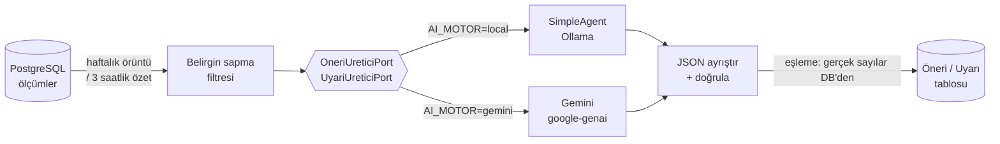

# AI Öneri ve Uyarı Motoru

Backend, topladığı yoğunluk verisini bir dil modeline yorumlatarak iki tür çıktı üretir:

| Çıktı | Neye bakar | Ne üretir | Ne zaman çalışır |
|---|---|---|---|
| **Öneri** | Son 30 günün haftalık örüntüsü | "Pazartesi sabah 8'de sefer sayısını artırmayı düşünün" | Haftalık zamanlayıcı (`ONERI_CALISMA_GUNU/SAATI`) |
| **Uyarı** | Son 3 saatin canlı yoğunluğu | "Yoğunluk eşiği aşılmıştır. Ek sefer değerlendirilebilir." | Periyodik zamanlayıcı (`UYARI_CALISMA_PERIYODU_SN`) |

**Varsayılan olarak tamamen lokaldir:** model Ollama'da yerelde çalışır, bulut API'si
çağrılmaz — veri makineden çıkmaz.

> Kesin kaynak ve kurulum reçetesi: `backend/README.md` → "AI öneri ve uyarı motoru".
> Bu sayfa özettir.

## Motor seçimi

Tek bir ortam değişkeni hem öneriyi hem uyarıyı yönetir:

```bash
AI_MOTOR=local    # varsayılan — OpenJarvis SimpleAgent + Ollama, veri yerelde kalır
AI_MOTOR=gemini   # açık tercih — GEMINI_API_KEY zorunlu
```

Yapılandırma tutarsızsa servis **açılışta açık hata verir** (örn. `AI_MOTOR=gemini`
ama anahtar yok). Sessizce yanlış motora düşmez.

## Gizlilik: fallback bilinçli olarak asimetrik

| Seçim | Birincil | Yedek | Neden |
|---|---|---|---|
| `local` | Yerel model | **yok** | "Yerel istiyorum" diyenin verisi kaza eseri buluta sızmasın |
| `gemini` | Gemini | yerel model | Bulut düşerse yerele düşmek güvenli yön |

`AI_MOTOR=local` iken Gemini nesnesi **hiç oluşturulmaz** — ortamda geçerli bir
`GEMINI_API_KEY` dursa bile. Yerel model erişilemezse sistem boş sonuç döner ve
loglar; buluta düşmez. Yani gizlilik bir söz değil, kodun yapısındadır.

> **Gizlilik uyarısı:** `AI_MOTOR=gemini` seçilirse yoğunluk özeti Google'a gider.
> "Veri makineden çıkmaz" garantisi yalnız varsayılan lokal modda geçerlidir.
> Bu mod opsiyoneldir, varsayılan değildir.

## Nasıl çalışır?



Her iki motor da aynı port sözleşmesini uygular; prompt, şema ve eşleme mantığı
ortaktır. Motor seçimi yalnız kompozisyon kökünde (`main.py`) yapılır — use-case'ler
hangi modelin çalıştığını bilmez. Bu, heksagonal mimarinin pratik faydasıdır:
ikinci motoru eklemek tek bir bağlama noktasına dokunmayı gerektirdi.

## Ölçek: modele ne kadar veri gider?

30 günlük ham örüntü **168 satır / ~34.000 karakter** çıkar. Yerel modeller bu
boyutta talimatı kaybedip düz metne kaçıyor.

Bu yüzden LLM'e gitmeden önce **belirgin sapmalar** süzülür (%15 eşik, en fazla 12
satır) — 168 satır pratikte **2 satıra** iner. Eşleme yine tam veriye karşı yapılır,
hiçbir satır kaybolmaz. Aynı süzme hem maliyeti hem de modele gösterilen veriyi azaltır.

## Model hata yaparsa ne olur?

Yerel modeller şemayı API düzeyinde garanti edemez (Ollama yalnız "JSON üret"
diyebilir, şemayı dayatamaz). Bu yüzden savunmacı bir katman vardır:

- Yanıtı ` ```json ` bloğu sararsa → soyulur
- Yanıtın içinde açıklama metni varsa → ilk `{...}` bloğu çıkarılır
- JSON yine bozuksa → **boş liste**, servis çökmez, uyarı loglanır
- Model olmayan bir hat/gün/saat uydurursa → o madde atlanır, loglanır
- Doluluk ve kişi sayısı gibi **gerçek sayılar modelden değil veritabanından** alınır

Son madde önemlidir: model yalnızca *yorumu* üretir, veriyi değil. Uydurduğu bir
sayı kayda geçemez.

## Model seçimi

Lokal modda **~9b sınıfı bir model önerilir** (varsayılan
`alibayram/turkish-gemma-9b-v0.1`). Küçük modeller (~1b) JSON'u güvenilir üretmez;
denendiğinde düz metne kaçtılar — sistem beklendiği gibi boş liste dönüp ayakta kaldı,
ama kullanılabilir öneri üretilemedi.

## Uçlar

Zamanlayıcıyı beklemeden manuel tetiklemek için (geliştirme/demo):

| Metot | Yol | Ne yapar |
|---|---|---|
| GET | `/api/oneriler` | Kayıtlı önerileri listeler |
| POST | `/api/oneriler/uret` | Öneri üretimini hemen tetikler |
| GET | `/api/uyarilar` | Kayıtlı uyarıları listeler |
| POST | `/api/uyarilar/uret` | Uyarı üretimini hemen tetikler |

Ayrıntı: [api.md](api.md).
