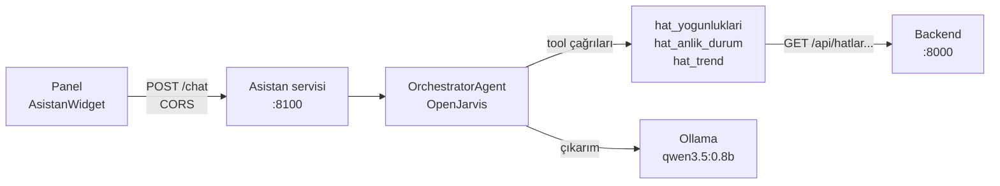

# Asistan (Chatbot)

YOTAY paneline, sistemdeki gerçek yoğunluk verisiyle konuşan bir asistan eklendi.
Panel kullanıcısı "Şu an en yoğun hat hangisi?" diye sorar; asistan backend REST
API'sinden gerçek veriyi çekip Türkçe cevaplar.

**Varsayılan olarak tamamen lokaldir:** LLM (qwen3.5:0.8b) Ollama'da yerelde çalışır,
bulut API'si çağrılmaz — veri makineden çıkmaz. Ayrı bir servistir (`asistan/`),
backend'e REST üzerinden bağlanır.

> Kesin kaynak ve kurulum reçetesi: depo kökündeki `asistan/README.md`. Bu sayfa özettir.

## Nasıl çalışır?



Asistan, soruyu OpenJarvis'in `OrchestratorAgent`'ına verir; agent gerektiğinde
tool çağırır (function calling), tool'lar veriyi backend REST API'sinden okur, ve
model sonucu Türkçe cevaba dönüştürür.

## Tool'lar

Üç tool, veriyi doğrudan DB'den değil backend REST API'sinden çeker:

| Tool | Ne yapar | Backend ucu |
|---|---|---|
| `hat_yogunluklari` | Tüm hatların anlık yoğunluk özeti | `GET /api/hatlar` |
| `hat_anlik_durum` | Bir hattın araç bazlı anlık durumu | `GET /api/hatlar/{id}/anlik` |
| `hat_trend` | Bir hattın son saatlerdeki trendi | `GET /api/hatlar/{id}/trend` |

## Opsiyonel: Gemini modu

Yerel modelin cevap kalitesi yetmezse, tek env değişkeniyle Google Gemini'ye
geçilebilir (`ASISTAN_MOTOR=cloud`, `ASISTAN_MODEL=gemini-3-flash`, `GEMINI_API_KEY`).
Aynı tool'lar, aynı reçete geçerlidir.

> **Gizlilik uyarısı:** Gemini modunda sorular **ve tool sonuçları — yani gerçek
> yoğunluk verileri —** Google'a gider. "Veri makineden çıkmaz" garantisi yalnız
> varsayılan lokal modda geçerlidir. Gemini ayrıca ücretlidir. Bu mod opsiyoneldir,
> varsayılan değildir.

## API

`POST /chat` (asistan servisi `:8100`'de, `/api` prefix'i **yok**):

```jsonc
// istek
{ "mesaj": "34 hattında durum ne?" }

// yanıt
{
  "cevap": "34 hattında şu an durum: ...",
  "tur_sayisi": 2,
  "arac_cagrilari": ["hat_anlik_durum"]
}
```

`GET /saglik` → `{ "durum": "calisiyor" }`.

Ayrıntı: [api.md](api.md) → Asistan servisi.
