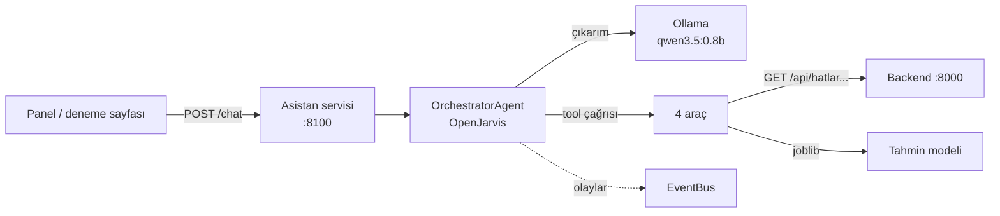

# Asistan (Chatbot)

Sistemdeki gerçek yoğunluk verisiyle konuşan bir asistan. Operatör *"Şu an en
yoğun hat hangisi?"* diye sorar; asistan backend REST API'sinden veriyi çekip
Türkçe yanıtlar.

**Varsayılan olarak tamamen lokaldir:** model (`qwen3.5:0.8b`) Ollama'da yerel
çalışır, bulut API'si çağrılmaz — soru da veri de makineden çıkmaz. Ayrı bir
servistir (`asistan/`), backend'e REST üzerinden bağlanır.

> Kesin kaynak ve kurulum reçetesi: `asistan/README.md`. Bu sayfa özettir.

## Nasıl çalışır?


```mermaid
graph LR
    PANEL[Panel / deneme sayfası] -->|POST /chat| SERVIS[Asistan servisi<br/>:8100]
    SERVIS --> AGENT[OrchestratorAgent<br/>OpenJarvis]
    AGENT -->|çıkarım| OLLAMA[Ollama<br/>qwen3.5:0.8b]
    AGENT -->|tool çağrısı| TOOLS[4 araç]
    TOOLS -->|GET /api/hatlar...| BACKEND[Backend :8000]
    TOOLS -->|joblib| MODEL[Tahmin modeli]
    AGENT -.olaylar.-> BUS[EventBus]
```

Soru OpenJarvis'in `OrchestratorAgent`'ına verilir; ajan gerektiğinde tool
çağırır (function calling), tool'lar veriyi backend'den okur, model sonucu
Türkçe cevaba dönüştürür. Her adım ayrıca `EventBus`'a yayılır.

## Araçlar

| Araç | Ne yapar | Kaynak |
|---|---|---|
| `hat_yogunluklari` | Tüm hatların anlık yoğunluk özeti | `GET /api/hatlar` |
| `hat_anlik_durum` | Bir hattın araç bazlı anlık durumu | `GET /api/hatlar/{id}/anlik` |
| `hat_trend` | Bir hattın son saatlerdeki seyri | `GET /api/hatlar/{id}/trend` |
| `yogunluk_tahmini` | Hava + saate göre doluluk tahmini | Yerel joblib modeli |

İlk üçü **canlı ölçüm** döndürür. Dördüncüsü ekip arkadaşımızın eğittiği ayrı
bir makine öğrenmesi modelidir (LinearRegression + OneHotEncoder) ve çıktısına
**her zaman** şu not eklenir:

> *Not: Bu bir tahmindir (sentetik veriyle eğitilmiş demo modeli), gerçek ölçüm
> değildir.*

Ayrım kasıtlıdır: tahmin ile ölçüm karışırsa operatör olmayan bir veriye
güvenebilir. Model artefaktı yoksa asistan üç araçla çalışmaya devam eder,
açılışta çökmez.

---

## Küçük modelle güvenilir tool çağırma

0.8B parametreli bir modelde function calling **kırılgandır**. Aşağıdaki üçlü
deneyle bulundu ve `cekirdek.py`'de kodlu:

**1. Sistem promptu `AgentContext` konuşmasına SYSTEM mesajı olarak konur.**
OpenJarvis'in `OrchestratorAgent(system_prompt=...)` parametresi function-calling
modunda **yok sayılıyor** (yukarı akış hatası: `_run_function_calling` promptu
`_build_messages`'a iletmiyor). Yok sayılınca config'in İngilizce varsayılan
promptu devreye giriyor ve tool çağırmayı bozuyor. Bu yüzden OpenJarvis
**SHA-pinli** kurulur (`8b59eb8`).

**2. `temperature = 0.0`.** 0.7'de tool çağırma yazı-tura gibi rastgeleleşiyor.

**3. Sistem promptu çok kısa tutulur.** Ölçüm: 2 cümlelik sert prompt + tool
adları **2/2** tool çağırttı; aynı prompta *tek cümle* eklemek **0/2**'ye
düşürdü. Genişletmeden önce varyant testi tekrarlanmalı.

| Ayar | Değer |
|---|---|
| `temperature` | 0.0 |
| `max_turns` | 6 |
| `max_tokens` | 512 |

---

## Hafıza: neden yok?

Her soru için **sıfırdan** ajan kurulur; önceki konuşma taşınmaz.

| Soru | Sonuç |
|---|---|
| "15B hattı nasıl?" | Çalışır |
| Ardından: "peki trendi?" | **Çalışmaz** — hangi hattı kastettiğini bilmez |
| "15B hattının trendi ne?" | Çalışır |

Sebep yukarıdaki 3. maddeyle aynı: model bağlam uzunluğuna aşırı duyarlı.
Biriken konuşma geçmişi tool çağırma davranışını bozuyor. Durumsuz tasarım doğru
araç çağırma oranını yüksek tutuyor.

Sunucuda oturum kavramı da yoktur — sohbet geçmişi **saklanmaz**.

---

## EventBus: modelin her adımı görünür

OpenJarvis'in `EventBus`'ı ajanın attığı her adımı olay olarak yayınlar. Asistan
servisi bunları **SSE** ile akıtır (`POST /chat/akis`).

Tek bir soru için gerçek dizi:

```
agent_turn_start   {agent, input}
inference_start    {model}
inference_end      {usage, content, tool_calls[]}   ← araç kararı burada
tool_call_start    {tool, arguments}
tool_call_end      {tool, success, latency, result} ← aracın ham çıktısı
inference_start / inference_end                      (2. tur)
agent_turn_end     {turns, content_length}
```

Bunun pratik değeri kanıtlandı: *"İstanbul'un nüfusu kaç?"* sorusuna asistan
**hiç tool çağırmadan** sistemde bulunmayan hat numaraları uydurdu. Tool
çağrılmadan gelen cevap = uydurma riski — ve bu ancak adımlar görünürse fark
edilir.

Deneme sayfası bunu kullanıcıya söyler: araç çağrılmamışsa cevabın altına
*"araç kullanılmadı — doğrulanmamış"* uyarısı düşer.

**Teknik not:** `EventBus.publish` abonelerini yayınlayan iş parçacığında senkron
çağırır, `OrchestratorAgent.run` ise bloklayıcıdır. Olayları async üretece
taşımak için `queue.Queue` + `anyio.to_thread.run_sync(..., abandon_on_cancel=True)`
köprüsü kullanılır. Bus **istek başına** kurulur; paylaşımlı olsaydı eşzamanlı
iki istek birbirinin olaylarını görürdü.

> Token-token streaming **yoktur**: pinli sürümde `inference_end` cevabı tek
> parça verir. Akan şey adımlardır, harfler değil.

---

## Model seçimi

Deneme ekranından model değiştirilebilir:

| Model | Boyut | Not |
|---|---|---|
| `qwen3.5:0.8b` | ~1 GB | Varsayılan, en hızlı |
| `qwen3.5:1.7b` | ~1.4 GB | |
| `qwen3.5:4b` | ~2.6 GB | Daha isabetli, yavaş |
| `llama3.2:3b` | ~2 GB | |

Varsayılan ilk açılışta otomatik iner. Diğerleri seçildiğinde indirilir. Serbest
model adı kabul edilmez — keyfi `/api/pull` tetiklenmesini önlemek için liste
sunucuda doğrulanır.

---

## Bilinen zayıflık

Küçük model bazen aracın *"veri yok"* dediği bir hattı yoğun sanabiliyor veya
sistemde olmayan bir hat numarası uydurabiliyor. Bu bir kod hatası değil,
**ölçülmüş bir model sınırı**. EventBus sekmesinden aracın gerçekte ne
döndürdüğü karşılaştırılabilir; daha büyük model genelde düzeltir.

---

## API

Asistan servisi `:8100`'de çalışır (`/api` öneki **yok**):

```jsonc
// POST /chat
{ "mesaj": "15B hattında durum ne?", "model": "qwen3.5:0.8b" }

// yanıt
{
  "cevap": "15B hattında şu an ...",
  "tur_sayisi": 2,
  "arac_cagrilari": ["hat_anlik_durum"],
  "model": "qwen3.5:0.8b"
}
```

| Uç | İşlev |
|---|---|
| `POST /chat` | Soru → cevap |
| `POST /chat/akis` | Soru → SSE olay akışı |
| `GET /modeller` | Seçilebilir modeller + indirilme durumu |
| `POST /modeller/indir` | Modeli Ollama'ya çeker |
| `GET /saglik` | `{"durum": "calisiyor"}` |

Ayrıntı: [REST & WebSocket](api.md).

---

## Denemek

Kod okumadan denemek için: [Asistan Deneme Sayfası](asistan-deneme.html) —
depodaki `docs/asistan-deneme.html` dosyasına çift tıklamanız yeterli. Sohbet ve
canlı EventBus sekmeleri vardır.

## Opsiyonel: Gemini modu

Yerel modelin kalitesi yetmezse tek ortam değişkeniyle Gemini'ye geçilir
(`ASISTAN_MOTOR=cloud`, `ASISTAN_MODEL=gemini-3-flash`, `GEMINI_API_KEY`). Aynı
araçlar, aynı reçete geçerlidir.

> **Gizlilik uyarısı:** Bu modda sorular **ve tool sonuçları — yani gerçek
> yoğunluk verileri —** Google'a gider. "Veri makineden çıkmaz" garantisi yalnız
> varsayılan lokal modda geçerlidir. Gemini ayrıca ücretlidir.
