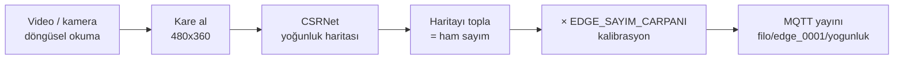

# Edge & CSRNet

Sistemin görüntüyle temas eden tek parçası. Araç içi kamera görüntüsünden kişi
sayısını kestirir ve **yalnız sayıyı** MQTT'ye yayınlar.

> Kesin kaynak: `edge/README.md` ve `model/README.md`. Bu sayfa özettir.

## Neden "edge"?

Çıkarım araç üzerinde yapılır, sunucuda değil. İki sebep:

- **Gizlilik** — yolcu görüntüsü ağa hiç çıkmaz. Yayınlanan şey
  `{"kisi_sayisi": 23}`. Sızdırılacak bir video akışı yoktur.
- **Bant genişliği** — 4G üzerinden video akıtmak yerine saniyede birkaç bayt.

Tünel/kapsama kaybı için de tasarlanmıştır: bağlantı koptuğunda ölçümler
**çekim damgalarıyla** biriktirilir, bağlantı gelince toplu boşaltılır. Backend
bunları geldikleri ana değil, damgalarındaki ana yazar.

## Boru hattı



CSRNet bir *yoğunluk haritası* üretir; haritanın toplamı tahmini kişi sayısıdır.
Kutu çizen bir dedektör değildir — kalabalıkta üst üste binen insanları saymak
için tasarlanmıştır.

| Dosya | Sorumluluk |
|---|---|
| `edge/app/video_kaynagi.py` | Videoyu döngüsel okur, kare verir |
| `edge/app/csrnet_agi.py` | Ağ tanımı, ağırlık yükleme |
| `edge/app/csrnet_kestirim.py` | Kare → kişi sayısı |
| `edge/app/sahte_kestirim.py` | Modelsiz test için sahte sayaç |
| `edge/app/yayinci.py` | MQTT yayını, LWT, yeniden bağlanma |
| `edge/app/calistir.py` | Döngü, hata toparlama |

---

## Model seçimi: neden Part B?

CSRNet'in iki resmi ağırlığı var. ShanghaiTech **Part A** yoğun kalabalıklar
(stadyum, miting), **Part B** seyrek sahneler (sokak) için eğitilmiş.

Otobüs içi orta yoğunluktadır. Fark ölçüldüğünde belirgin — düz gri bir karede
(yani hiç insan yokken):

| Ağırlık | Boş karede tahmin | MAE |
|---|---|---|
| Part A | 7.33 hayalet kişi | 65.90 |
| **Part B** | **0.13** | **9.69** |

Part A'nın taban gürültüsü tek başına sayımı bozuyor. Part B seçildi.

### Ağırlık deposunda hazır gelir

`model/csrnet_partB.pth`, **65 MB**, depoya dahil — klonlayan indirme yapmaz,
sunum günü Google Drive kotasına bağımlı kalınmaz.

Orijinal checkpoint 130 MB'tı; `optimizer` state ve `epoch` alanları atılarak
yalnız `state_dict` bırakıldı. Bunlar sadece eğitime devam etmek için gerekli,
çıkarımda kullanılmıyor. Dosya yarıya inince GitHub'ın 100 MB limitinin altına
girdi — **Git LFS'e gerek kalmadı**.

---

## Kalibrasyon: en kritik nokta

CSRNet **sokak/tepeden çekim** kafa anotasyonlarıyla eğitilmiştir. Otobüs içi
görüntüsü yakın mesafeli ve okluzyonlu — yani **eğitim dağılımının dışında**.
Sistematik sapma beklenir ve gerçekten de vardır.

Bunu ölçtük: 45 saniyelik demo videosunun **her saniyesi elle sayıldı** ve
CSRNet ham çıktısıyla karşılaştırıldı.

| Ölçüt | Değer |
|---|---|
| Korelasyon (ham ↔ gerçek) | **0.88** |
| Ham sayım ortalaması | 5.43 (gerçek: 4.11) |
| MAE, çarpansız | 1.64 kişi |
| MAE, çarpan uygulanmış | **1.06 kişi** |
| En küçük kareler çarpanı | **0.78** |

Sonucun okunuşu önemli: korelasyon yüksek, yani model **değişimi doğru takip
ediyor** — otobüs dolduğunda sayı artıyor, boşaldığında düşüyor. Bozuk olan
sadece *ölçek*: sistematik olarak fazla sayıyor. Tek bir çarpan bunu düzeltiyor
ve hata %35 azalıyor.

Bu yüzden `docker-compose.yml`'de varsayılan `EDGE_SAYIM_CARPANI=0.78`.

> **Başka bir video veya kamera açısı için yeniden ölçülmelidir.** Çarpan bu
> videoya özeldir, evrensel bir düzeltme değildir. Ham sayım da loglanır
> (`DEBUG`), böylece çarpanın etkisi ayırt edilebilir.

Yöntem ve bilinen sınırlar: [Veri Metodolojisi](veri-metodolojisi.md).

---

## Performans

CPU'da ölçülen çıkarım süreleri (girdi boyutuna kabaca doğrusal):

| Girdi | 1 iş parçacığı | 4 iş parçacığı |
|---|---|---|
| 320×240 | 0.53 s | — |
| **480×360** (varsayılan) | **1.28 s** | — |
| 640×480 | 2.26 s | 0.85 s |
| 1920×1080 | — | 5.91 s |

Varsayılan 480×360, 2 saniyelik yayın periyoduna rahat sığar. Tepe bellek ~1 GB.
GPU gerekmez.

### Çıkarım neden ayrı iş parçacığında?

`asyncio.to_thread` ile koşar. Doğrudan çağrılsaydı olay döngüsü 1.3 saniye
bloklanır, MQTT keepalive kaçar, broker istemciyi düşürür, vasiyet (LWT)
tetiklenir ve backend cihazı **tam çalışırken** çevrimdışı işaretlerdi.

Aynı sınıf hata simülatörde de yaşandı: yük altında kaçırılan tek bir keepalive
süreci öldürüyordu, çünkü yeniden bağlanma döngüsü yoktu. Artık ikisinde de var.

---

## Çalıştırma

```bash
# Gerçek modelle (video + ağırlık hazırsa)
docker compose --profile gercek up --build
```

`gercek` profili `edge/videolar/otobus.mp4` bekler. Video `.gitignore`'dadır —
depoyu klonlayanda **yoktur**. Videosuz denemek için `--profile demo` kullanın;
simülatör sahte veri üretir, boru hattının kalanı aynen çalışır.

Karma demo: `simulator_karma` servisi `--atla 1` ile `edge_0001`'i dışarıda
bırakır. Böylece panelde **bir araç gerçek CSRNet sayımıyla**, diğerleri
simülasyonla akar.

### Ortam değişkenleri

| Değişken | Varsayılan | Açıklama |
|---|---|---|
| `EDGE_MOTOR` | `csrnet` | `sahte` ile modelsiz çalışır |
| `EDGE_VIDEO_YOLU` | `/uygulama/videolar/otobus.mp4` | Video kaynağı |
| `EDGE_AGIRLIK_YOLU` | `/uygulama/model/csrnet_partB.pth` | Ağırlık dosyası |
| `EDGE_SAYIM_CARPANI` | `0.78` | Kalibrasyon çarpanı |

---

## Bilinen sınırlar

- **Çarpan videoya özel.** Farklı kamera açısı → yeniden kalibrasyon.
- **Dağılım dışı girdi.** Model otobüs içi için eğitilmedi; MAE ~1 kişi iyi bir
  sonuç ama mutlak sayıya kritik karar bağlanmamalı.
- **Tek kamera varsayımı.** Bir araçta tek kaynak; çok kameralı birleştirme yok.
- **Aydınlatma.** Gece/tünel görüntüsü ayrıca ölçülmedi.
