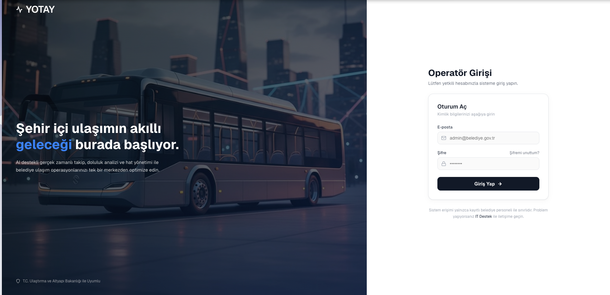
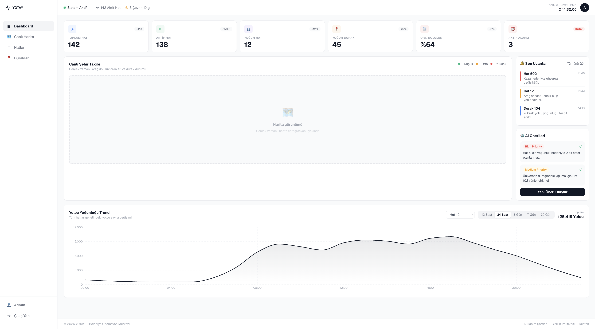
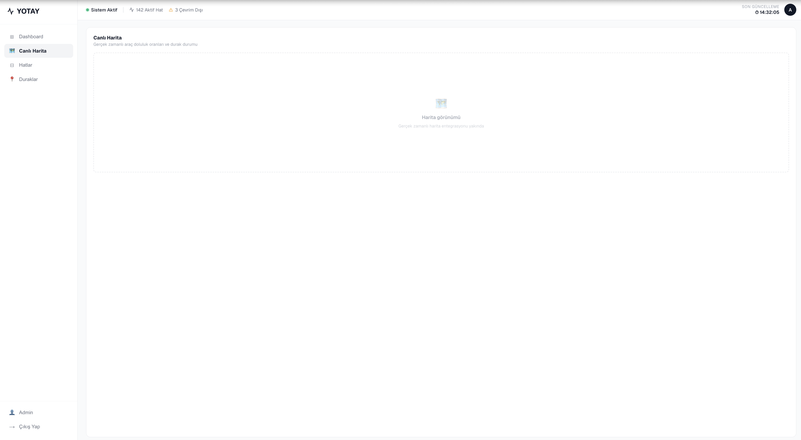
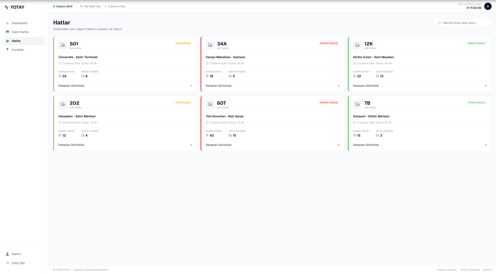
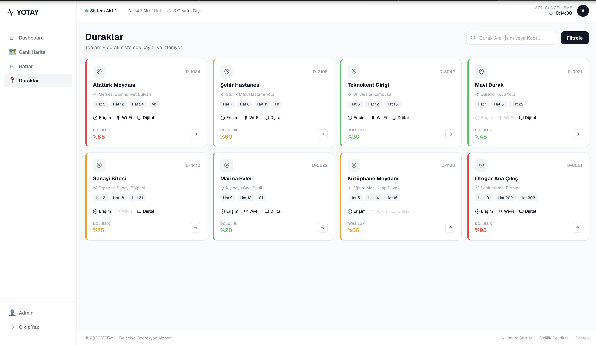

# Ekran Görüntüleri

YOTAY admin panelinin (frontend) mevcut sayfaları.

## Giriş

Split-screen giriş ekranı. JWT tabanlı gerçek kimlik doğrulama yapar: `POST /api/oturum`
ile e-posta/şifre doğrulanır, dönen erişim token'ı tarayıcıda saklanır.

## Kontrol Paneli

Hat bazlı doluluk trendlerini Recharts ile gösteren genel özet ekranı. Zaman aralığı (12s/24s/3g/7g/30g) ve hat filtresi destekler.

## Canlı Harita

Araçların anlık konum ve doluluk durumunu haritada gösteren sayfa.

## Hatlar

Backend'e bağlı tek sayfa — `GET /api/hatlar`'dan gerçek veri çeker (hat no, güzergah, ortalama doluluk, araç sayısı). Backend'e erişilemezse demo veriye düşer.

## Duraklar

Durak listesi, arama/filtreleme ve erişilebilirlik/wifi/dijital ekran bilgisi.

## Asistan (Sohbet)

Oturum açıldıktan sonra her sayfanın sağ altında bir 💬 düğmesi bulunur; tıklanınca
yüzen sohbet paneli açılır. Kullanıcı yoğunluk sorularını doğal dille sorar, asistan
gerçek veriyle Türkçe cevaplar (bkz. [Asistan](asistan.md)).

> **Not:** Ekran görüntüsü eklenecek. Sohbet paneli mevcut 5 ekranın hepsinde sağ
> altta görünür; yukarıdaki görseller widget eklenmeden önce çekilmiştir.

---

Kaynak kod: `frontend/src/pages/` ve `frontend/src/components/AsistanWidget.jsx`.
Sayfa bazında hangi verinin gerçek/mock olduğu için bkz. `frontend/README.md` → API entegrasyonu.
