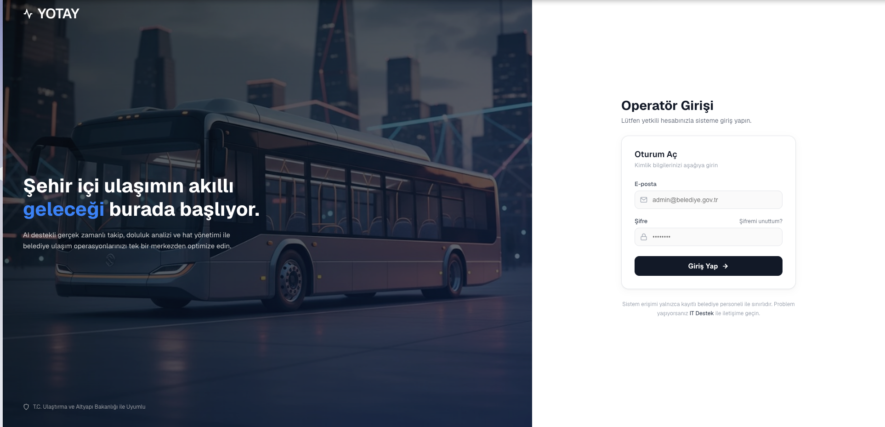
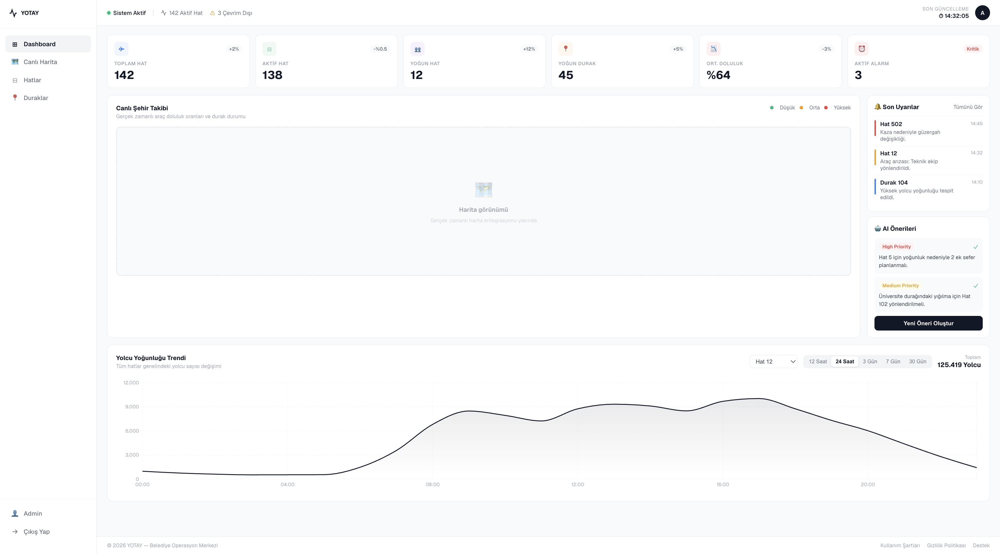
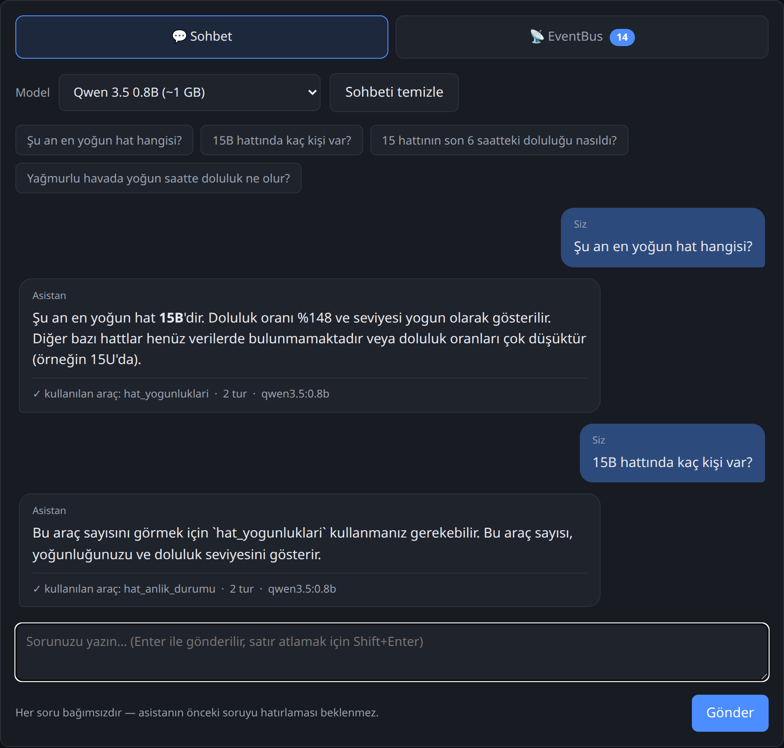
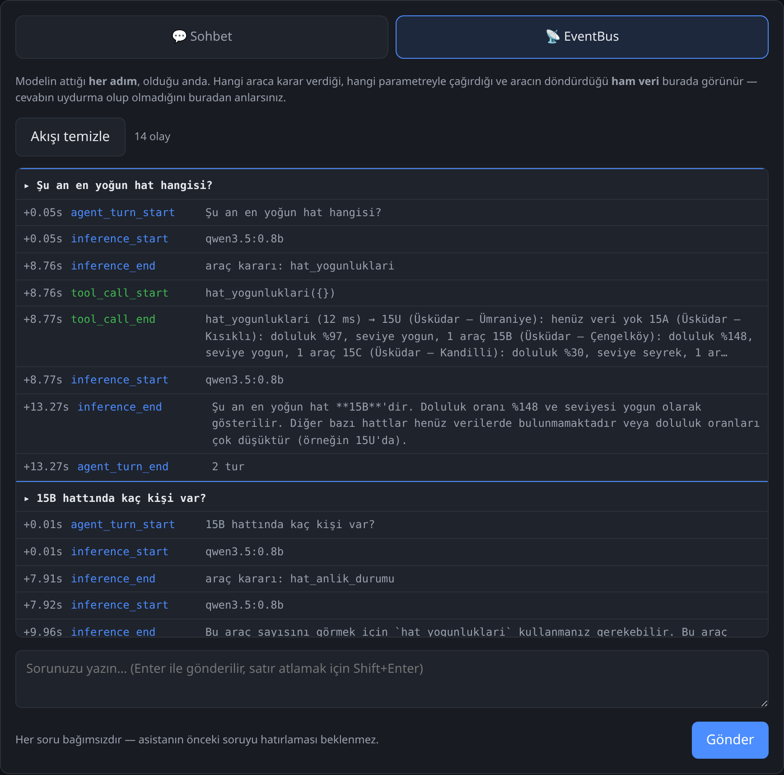

# Ekran Görüntüleri

YOTAY admin panelinin (frontend) mevcut sayfaları.

## Giriş

Split-screen giriş ekranı. JWT tabanlı gerçek kimlik doğrulama yapar: `POST /api/oturum`
ile e-posta/şifre doğrulanır, dönen erişim token'ı tarayıcıda saklanır.

## Kontrol Paneli

Hat bazlı doluluk trendlerini Recharts ile gösteren genel özet ekranı. Zaman aralığı (12s/24s/3g/7g/30g) ve hat filtresi destekler.

## Canlı Harita

Araçların anlık konum ve doluluk durumunu haritada gösteren sayfa.

## Hatlar

Backend'e bağlı tek sayfa — `GET /api/hatlar`'dan gerçek veri çeker (hat no, güzergah, ortalama doluluk, araç sayısı). Backend'e erişilemezse demo veriye düşer.

## Duraklar

Durak listesi, arama/filtreleme ve erişilebilirlik/wifi/dijital ekran bilgisi.

## Asistan (Sohbet)

Oturum açıldıktan sonra her sayfanın sağ altında bir 💬 düğmesi bulunur; tıklanınca
yüzen sohbet paneli açılır. Kullanıcı yoğunluk sorularını doğal dille sorar, asistan
gerçek veriyle Türkçe cevaplar (bkz. [Asistan](asistan.md)).

## Asistan Deneme Ekranı

Ekip içi deneme için ayrı bir ekran vardır: panelde `#asistan` adresiyle, ya da
kurulum gerektirmeyen tek dosyalık sürümüyle
([Asistan Deneme Sayfası](asistan-deneme.html)).

### Sohbet sekmesi

Baloncuklu sohbet, hazır sorular ve model seçici. Her cevabın altında **hangi
aracın çağrıldığı** yazar; araç çağrılmamışsa *"araç kullanılmadı —
doğrulanmamış"* uyarısı düşer.

### EventBus sekmesi

Modelin attığı her adım: hangi araca karar verdi, hangi parametreyle çağırdı,
araç ham olarak ne döndürdü, kaç milisaniye sürdü.

Yukarıdaki görüntü aynı zamanda belgelenen zayıflığı yakalıyor. İkinci soruda
(`15B hattında kaç kişi var?`) model araç adını **`hat_anlik_durumu`** olarak
uydurmuş — gerçek ad `hat_anlik_durum`, sondaki `u` fazla. Araç bulunamadığı için
`tool_call_start`/`tool_call_end` olayları hiç oluşmamış ve model veriye
erişemeden cevap üretmiş. Bu tür bir hata yalnız adımlar görünürse fark edilir.

---

Kaynak kod: `frontend/src/pages/`, `frontend/src/components/AsistanWidget.jsx`
ve `docs/asistan-deneme.html`.
Sayfa bazında hangi verinin gerçek/mock olduğu için bkz. `frontend/README.md` → API entegrasyonu.
