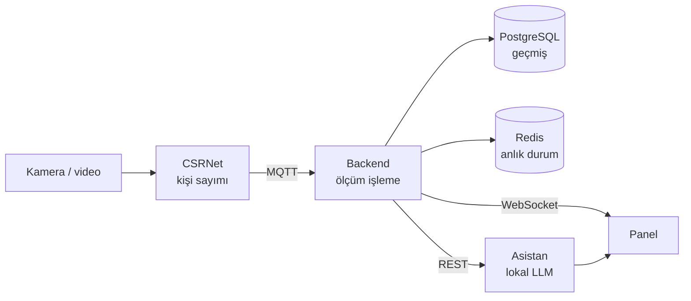

# YOTAY — Otobüs İçi Yoğunluk Tespiti

Toplu taşımada bir otobüsün **şu an ne kadar dolu olduğunu** kamera görüntüsünden
sayıp, hat bazında canlı takip edilebilir hâle getiren bir sistem. Üsküdar
hatlarıyla çalışır.

Sorun şu: toplu taşıma planlaması büyük ölçüde **statiktir** — sefer sıklığı
sabit tarifelere göre belirlenir, gerçek doluluk anlık olarak bilinmez. Yönetici
hangi hatta ek araç gerektiğini ancak şikâyet geldikten sonra öğrenir.

YOTAY bunu tersine çevirir: araçtaki kamera görüntüsü **araç üzerinde** işlenir,
yalnız kişi sayısı yayınlanır, panelde hat bazında canlı yoğunluk görünür ve
lokal bir dil modeli veriyi yorumlayıp operatöre Türkçe anlatır.

> **Bu site statik bir proje günlüğüdür.** Belgelerdeki `localhost` adresleri
> (Swagger, WebSocket, MQTT) yalnız sistemi kendi makinenizde çalıştırdığınızda
> açılır; bu sayfadan tıklandığında çalışmaz.

---

## Uçtan uca akış



Bir ölçümün yolculuğu:

1. **Araçta** — kameradan kare alınır, CSRNet kişi sayısını kestirir
   (bkz. [Edge & CSRNet](edge-csrnet.md))
2. **MQTT** — yalnız sayı yayınlanır, görüntü araçtan çıkmaz
   (bkz. [MQTT Sözleşmesi](mqtt.md))
3. **Backend** — ölçüm doğrulanır, doluluk oranı ve seviye hesaplanır, kaydedilir
   (bkz. [Sistem Mimarisi](mimari.md))
4. **Panel** — WebSocket ile anında görünür (bkz. [Ekran Görüntüleri](ekranlar.md))
5. **Asistan** — operatör soru sorunca aynı veriyi araçlarla okuyup yanıtlar
   (bkz. [Asistan](asistan.md))

## Bileşenler

| Bileşen | Ne yapar | Kod |
|---|---|---|
| **Edge** | Videodan CSRNet ile kişi sayıp MQTT'ye yayınlar | `edge/` |
| **Backend** | Ölçümü işler, saklar, REST + WebSocket ile sunar | `backend/app/` |
| **Panel** | Hat/durak/canlı harita ekranları | `frontend/src/` |
| **Asistan** | Soruları gerçek veriyle yanıtlayan lokal chatbot | `asistan/` |
| **Öneri & uyarı motoru** | Yoğunluk örüntüsünü yorumlayıp öneri üretir | `backend/app/adapters/cikan/` |
| **Simülatör** | Sahte cihazlarla canlı veri üretir (demo) | `backend/simulator/` |

---

## Gizlilik: neden lokal model?

Sistemdeki **iki AI parçası da varsayılan olarak tamamen yereldir**. Bu bilinçli
bir mimari karardır, sonradan eklenen bir özellik değil.

**Görüntü araçtan çıkmaz.** CSRNet çıkarımı edge tarafında yapılır; MQTT'ye
giden şey bir sayıdır (`{"kisi_sayisi": 23, ...}`). Yolcu görüntüsü ağ üzerinde
hiç taşınmaz — sızdırılacak bir video akışı yoktur.

**Yoğunluk verisi makineden çıkmaz.** Asistan ve öneri motoru
[Ollama](https://ollama.com) üzerinde yerel model çalıştırır. Soru da, aracın
döndürdüğü gerçek yoğunluk verisi de bilgisayarın dışına gitmez.

Bulut (Gemini) desteği vardır ama **açık tercihle** devreye girer ve belgelerde
uyarısı yazılıdır: o modda sorular *ve tool sonuçları* Google'a gider. Varsayılan
kurulumda hiçbir bulut API'si çağrılmaz — internet olmadan da çalışır (modeller
bir kez indikten sonra).

Bunun bedeli var: küçük bir model (0.8B parametre) bulut modelleri kadar isabetli
değil. Sistemi bu gerçeği **gizlemek yerine görünür kılacak** şekilde tasarladık —
asistan hangi aracı çağırdığını söyler, çağırmadıysa cevabı "doğrulanmamış"
olarak işaretler.

---

## OpenJarvis nedir?

Asistan sıfırdan yazılmadı; [OpenJarvis](https://github.com/open-jarvis/OpenJarvis)
adlı açık kaynak ajan çatısı üzerine kuruldu. Sağladıkları:

| Parça | İşlevi |
|---|---|
| `OrchestratorAgent` | Modele soruyu verir, tool çağrılarını yürütür, cevabı toparlar |
| `ToolExecutor` | Tool çağrılarını çalıştırır, hata/zaman aşımı yönetir |
| `EventBus` | Ajanın **her adımını** olay olarak yayınlar |
| `OllamaEngine` | Yerel modelle konuşur |

`EventBus` bu proje için özellikle değerli: modelin hangi araca karar verdiği,
hangi parametreyle çağırdığı ve aracın ham çıktısı canlı izlenebiliyor. Deneme
ekranındaki **EventBus sekmesi** bunun üzerine kurulu — küçük modelin ne zaman
uydurduğunu gözle görmeyi sağlıyor.

> OpenJarvis depoda **SHA-pinli** kuruludur (`8b59eb8`). Sebep: `OrchestratorAgent`'ın
> `system_prompt` parametresi function-calling modunda yok sayılıyor (yukarı akış
> hatası); geçici çözüm bu sürüme göre yazıldı. Ayrıntı: [Asistan](asistan.md).

---

## Hızlı başlangıç

Docker Desktop kuruluysa tek komut:

```bash
git clone https://github.com/kkbradd/yzta-bootcamp-19
cd yzta-bootcamp-19
docker compose --profile demo up --build
```

- Panel: `http://localhost:3000`
- Backend API + Swagger: `http://localhost:8000/docs`
- Asistan servisi: `http://localhost:8100`

**İlk açılış ~10–15 dakika sürer** — Ollama dil modelini (~1 GB) indirir. Model
kalıcı bir volume'da kalır, sonraki açılışlar hızlıdır. Docker'a en az **8 GB**
bellek ayrılması önerilir.

Kod okumadan asistanı denemek için depodaki `docs/asistan-deneme.html` dosyasına
çift tıklamanız yeterli — bkz. [Asistan Deneme Sayfası](asistan-deneme.html).

| Profil | Ne çalışır | Şart |
|---|---|---|
| `demo` | Sohbet, araçlar, simülatörden canlı veri | Yok |
| `gercek` | Yukarıdakiler **+ videodan gerçek CSRNet sayımı** | `edge/videolar/otobus.mp4` |

---

## Teknoloji

| Katman | Seçim |
|---|---|
| Kişi sayımı | CSRNet (ShanghaiTech Part B), PyTorch, CPU |
| Backend | Python 3.12, FastAPI, heksagonal mimari |
| Veri | PostgreSQL (geçmiş), Redis (anlık durum, TTL) |
| Mesajlaşma | MQTT (Mosquitto), QoS 1, LWT |
| Panel | React, Vite, Recharts, Leaflet |
| AI | Ollama + Qwen 3.5, OpenJarvis ajan çatısı |
| Dağıtım | Docker Compose (tek komut) |
