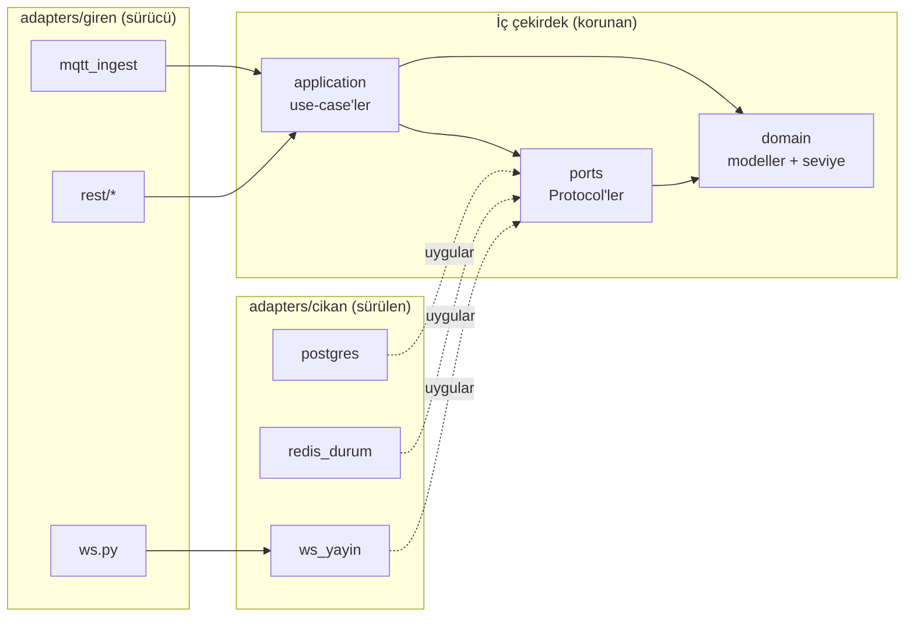

# Sistem Mimarisi

Backend, Heksagonal (Ports & Adapters) mimariyle yazıldı. Amaç: iş kuralları (domain + use-case) altyapıdan (PostgreSQL, Redis, MQTT, WebSocket) tamamen habersiz kalsın; altyapıyı değiştirmek iş kurallarına dokunmasın.

## Katmanlar ve sorumlulukları

Tümü `app/` altında:

| Katman | Dizin | Sorumluluk |
|---|---|---|
| **domain** | `app/domain/` | Saf iş nesneleri (`modeller.py`: frozen+slots dataclass'lar) ve saf kurallar (`seviye.py`: `doluluk_orani_hesapla`, `seviye_belirle`). Hiçbir dış kütüphane import etmez. Eşik sayıları burada yok — kural var, değer dışarıdan parametre gelir. |
| **ports** | `app/ports/` | `Protocol` sözleşmeleri. `depolar.py` (`OlcumDeposuPort`, `AtamaDeposuPort`), `anlik_durum.py` (`AnlikDurumPort`), `canli_yayin.py` (`CanliYayinPort`). Yalnız `app.domain` ve `app.ports` import eder. |
| **application** | `app/application/` | Use-case'ler. `olcum_isle.py` (`OlcumIsleyici` + `SeviyeEsikleri`), `cihaz_durum_isle.py` (`CihazDurumIsleyici`). Yalnız domain + ports'a konuşur, somut altyapıyı bilmez. |
| **adapters/giren** | `app/adapters/giren/` | Sürücü (driving) adaptörler — sistemi dışarıdan **tetikleyen** girdi uçları: `mqtt_ingest.py`, `ws.py`, `rest/*`. |
| **adapters/cikan** | `app/adapters/cikan/` | Sürülen (driven) adaptörler — use-case'in **çağırdığı** çıktı uçları: `postgres/`, `redis_durum.py`, `ws_yayin.py`. Bir port `Protocol`'ünü uygular. |

## Bağımlılık yönü kuralı: oklar yalnız içeri döner

- **domain** hiçbir şeye bağımlı değil (en iç).
- **ports** → domain'e.
- **application** → domain + ports'a.
- **adapters** dıştadır, içeriye bağımlıdır; ama korunan üç katman adapters'ı **asla** import edemez. Somut bağlama yalnız `main.py`'de yapılır.

## Sürücü vs. sürülen adaptör

- **Sürücü (giren):** akışı başlatır. MQTT dinleyicisi mesaj gelince use-case'i çağırır; REST router'ları HTTP isteğiyle; `ws.py` istemci bağlantısını `ws_yayin`'a kaydeder.
- **Sürülen (cikan):** use-case tarafından çağrılır, bir port'u uygular. `PostgresOlcumDeposu` → `OlcumDeposuPort`, `RedisAnlikDurum` → `AnlikDurumPort`, `BaglantiYoneticisi` (`ws_yayin.py`) → `CanliYayinPort`.

## Port ↔ somut adaptör eşleşmesi

| Port (`Protocol`) | Somut adaptör | Nerede |
|---|---|---|
| `OlcumDeposuPort` / `AtamaDeposuPort` | `PostgresOlcumDeposu` / `PostgresAtamaDeposu` | `adapters/cikan/postgres/depolar.py` |
| `AnlikDurumPort` | `RedisAnlikDurum` | `adapters/cikan/redis_durum.py` |
| `CanliYayinPort` | `BaglantiYoneticisi` | `adapters/cikan/ws_yayin.py` |

## Composition root (`app/main.py`)

`uygulama_olustur()` içindeki lifespan, tüm parçaları burada bağlar: motor + oturum fabrikası, Redis istemcisi ve `RedisAnlikDurum`, `BaglantiYoneticisi`, ardından bunları `OlcumIsleyici` / `CihazDurumIsleyici` içine enjekte eder. MQTT `ingest`, arka plan görevi olarak `asyncio.create_task` ile başlar. REST bağımlılıkları `app.state` üzerinden verilir; testler `dependency_overrides` ile sahtelerini takar. ASGI nesnesi `app.main:uygulama` adıyla export edilir.

## Fitness testi bu kuralı otomatik korur

`tests/unit/test_mimari.py`, `app/domain`, `app/ports`, `app/application` dosyalarındaki **tüm** import'ları AST ile tarar (göreli `from ..` dahil, mutlak yola çözerek). `KATMAN_IZINLERI` her katmanın import edebileceği app-içi kökleri tanımlar; standart kütüphane serbest, app-dışı her şey (sqlalchemy, redis, aiomqtt, fastapi, pydantic) yasak. İhlal varsa test `assert` ile kırılır. `adapters/` ve `main.py` kasıtlı taranmaz — altyapıyı import etmeleri normaldir.

Kesin kaynak referansı için bkz. `backend/README.md`.
